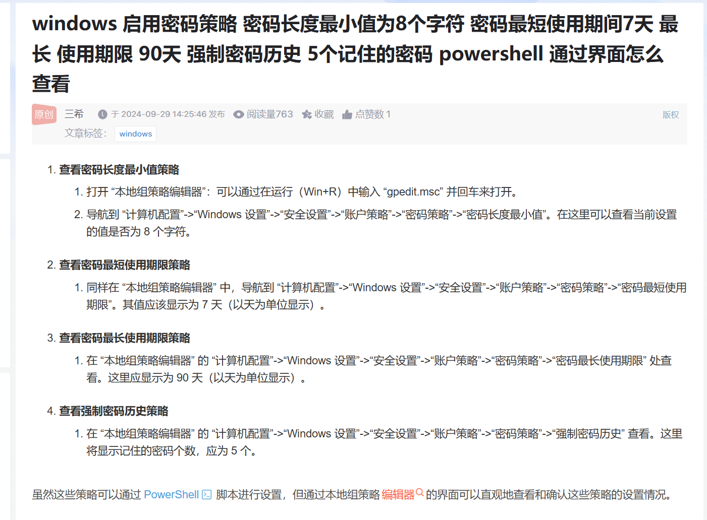
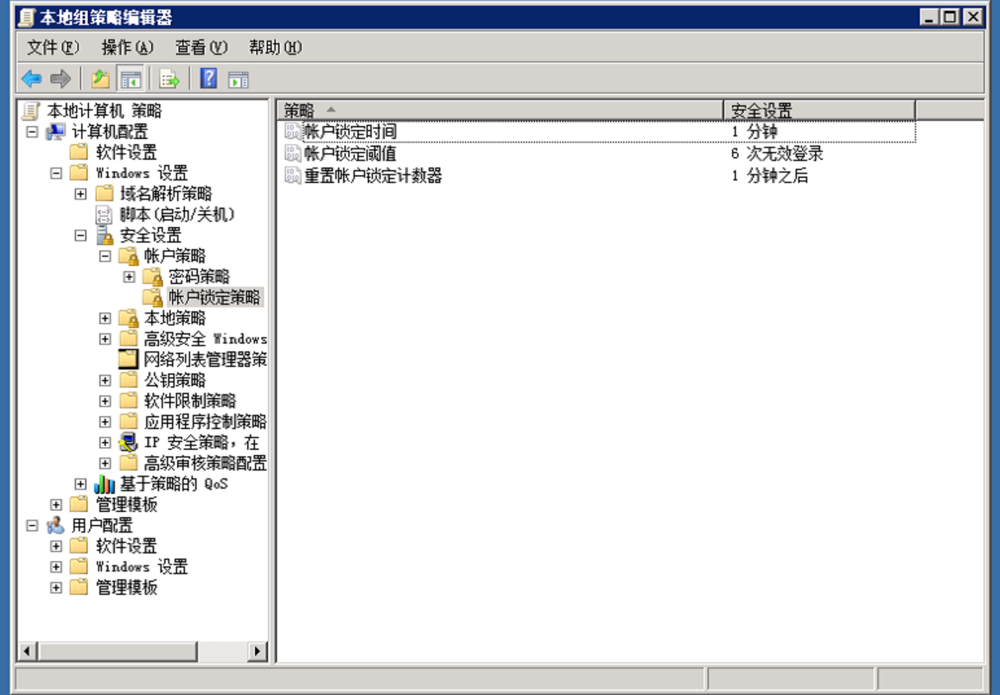
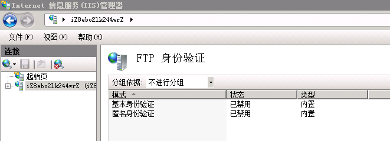

## 密码策略

gpedit.msc



## 账号策略

题目内容：设置一分钟内仅允许6次登录失败的尝试，超过6次，登录帐号锁定1分钟

```
本地安全策略` -> `账户策略` -> `账户锁定策略` ->`账户锁定阈值
本地安全策略` -> `账户策略` -> `账户锁定策略` ->`账户锁定时间
```



## 来宾用户

来宾访问计算机或访问域的内置帐户 设置为不允许

```
本地安全策略` -> `本地策略` -> `安全选项` -> `帐户：来宾帐户状态
```

## 账号控制

搜索 UAC也可以

```
所有程序` -> `附件` -> `系统工具` -> `控制面板` ->`用户账户` -> `更改用户账户控制设置
```

## 远程桌面设置

问题内容：设置远程桌面用户空闲会话超过5分钟自动断开连接

gpedit.msc

```
计算机配置` -> `管理模板` -> `Windows 组件` -> `远程桌面服务` -> `远程桌面会话主机`-> `会话时间限制
```

## ISS日志

问题内容：开启开启IIS的日志审计记录

```
服务器管理` -> `角色` -> `Web服务器IIS` -> `角色服务 添加角色服务` -> `健康与诊断` -> `勾选HTTP日志记录
```

## 关闭ftp匿名用户（注意ftp服务不能关闭）

```
控制面板`->`管理工具`->`IIS管理器` -> `ftp身份验证禁用匿名用户
```

