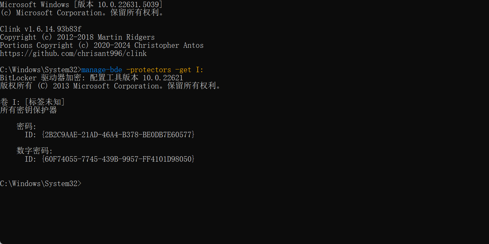

[SAM与System文件密码抓取-CSDN博客](https://blog.csdn.net/SWEET0SWAT/article/details/104488761)

[内网渗透神器（Mimikatz）——使用教程-CSDN博客](https://blog.csdn.net/weixin_40412037/article/details/113348310)

lsadump::sam /sam:sam /system:system

| 对比 | DD镜像                 | E01镜像                                          |
| ---- | ---------------------- | ------------------------------------------------ |
| 优点 | 镜像速度快             | 镜像速度慢                                       |
| 缺点 | 体积大，源盘多大它多大 | 体积小，有效压缩源盘未使用空间，可理解为压缩文件 |
| 哈希 | DD镜像哈希=源盘哈希    | E01镜像哈希≠源盘哈希                             |

### WIN注册表位置

- HKEY_LOCAL_MACHINE\SYSTEM : *\system32\config\system*
- HKEY_LOCAL_MACHINE\SAM : *\system32\config\sam*
- HKEY_LOCAL_MACHINE\SECURITY ：*\system32\config\security*
- HKEY_LOCAL_MACHINE\SOFTWARE ：*\system32\config\software*
- HKEY_USERS\UserProfile ：*\winnt\profiles\用户名*
- HKEY_USERS.DEFAULT : *\system32\config\default*

### 请计算源盘的hash值

这时我们需要先对镜像进行挂载，像ftk imager等等软件，再对挂载后的磁盘进行hash值的计算

镜像hash值

```
certutil -hashfile '文件路径' sha256
```

### win操作系统安装时间

- [打开cmd](https://so.csdn.net/so/search?q=打开cmd&spm=1001.2101.3001.7020)，输入systeminfo找到初始安装时间就可以了
- 文件setuplog.txt的修改日期即系统安装日期
  - XP:C:\WINDOWS\setuplog.txt
  - WIN7、10:c:\windows\setup\state\state.ini
- win+r 输入regedit查看注册表：HKEY_LOCAL_MACHINE\SOFTWARE\Microsoft\Windows NT\CurrentVersion

### win系统时区

- systeminfo

### WIN系统用户SID

- cmd：whoami /user
- cmd: wmic useraccount get name,sid
- powershell:Get-WmiObject win32_useraccount | Select Name,SID
- Get-LocalUser >win 10
- HKEY_LOCAL_MACHINE\SOFTWARE\Microsoft\Windows NT\CurrentVersion\ProfileList
- 


在系统下也可使用manage-bde将加密卷的恢复密钥读取出来。指令：manage-bde -protectors -get x: \\x表示盘符



## SQL


在MySQL配置文件my.ini的[mysqld]块下加入skip-grant-tables设置免密登录

### 密码上一次修改记录

mysql.user表中
