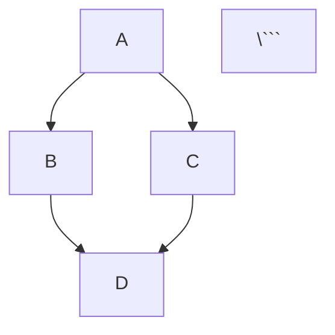

<!--more-->	

## 任务详情

```
你熟悉Markdown格式吗？选择自己熟悉的AI平台，把下面的提示词发给ta:
"""
作为计算机技术专家、人工智能技术专家，网络空间安全专家，密码学专家，密码技术专家，请您：
1. 深入浅出的讲解一下Mardown，Markdown的详细语法
2. 推荐至少两款线上工具，至少两种线下工具
3. 讲解Markdown的高级用法，包括插入数学公式、绘图、制作PPT，格式转换等
4. 讲解Markdown在chatgpt等AIGC的提示词工程中的应用
"""
学习、实践AI平台返回的内容，并回答：
1.哪些内容是你掌握的？哪些内容是你没有掌握的？使用AI推荐的工具或者你喜欢的工具实践一下没有掌握的内容。
2.要使用好AI工具，写好prompt(提示词)是非常重要的，提示词至少要有角色、上下文、任务。专家们提供了很多结构化提示词的框架，比如ICDO，BROKE，CRISP等，你知道哪些提示词框架？如果不知道，通过搜索工具或者AI工具学习一个。Markdown是结构化prompt的好方法，请为你学习的prompt框架使用Markdown格式设计一个通用模板
3.作业提交要求使用Markdown格式，同时提交Markdown转化的PDF，推荐在https://www.cnblogs.com/或https://www.csdn.net/等技术平台发表博客，提交博客链接。或者在https://github.com/或https://gitee.com/等代码托管平台完成任务，提交文档链接
```

## AI平台返回的内容：

### 1. 什么是Markdown？

Markdown是一种轻量级标记语言，旨在使文档的书写和阅读尽可能简单明了。它使用简洁的标记语法，可以轻松地将纯文本格式转换为格式丰富的文档，如HTML、PDF等。Markdown特别适合编写文档、笔记、博客等，因为它简洁直观，容易学习。

### 2. Markdown的详细语法

Markdown的基本语法包括以下几部分：

#### 标题
使用`#`表示标题，`#`的数量表示标题的层级，一级标题用一个`#`，二级标题用两个`#`，依此类推。

```markdown
# 一级标题
## 二级标题
### 三级标题
```

#### 列表
- 无序列表使用`*`、`-`或`+`加空格。
- 有序列表使用数字加点，例如 `1. `。

```markdown
- 无序列表项
* 另一项
+ 第三项

1. 有序列表项
2. 另一项
```

#### 强调
- **加粗**：使用`**`或`__`包裹文本。
- *斜体*：使用`*`或`_`包裹文本。
- ***加粗斜体***：组合使用`***`或`___`。

```markdown
**加粗**
*斜体*
***加粗斜体***
```

#### 引用
使用`>`表示引用。可以嵌套使用来创建多层引用。

```markdown
> 这是一个引用
>> 这是嵌套引用
```

#### 链接与图片
- 链接使用 `[显示文本](URL)` 语法。
- 图片使用 `` 语法。

```markdown
[这是一个链接](https://www.example.com)

```

#### 代码块
- 行内代码使用`` ` ``包裹代码。
- 多行代码块使用三个反引号``` 包裹代码，并可指定语言。

```markdown
`行内代码`
```
\```python
def hello():
    print("Hello, World!")
\```
```

#### 表格
表格使用管道符`|`和连字符`-`来表示。

```markdown
| 表头1 | 表头2 |
| ------ | ------ |
| 单元格1 | 单元格2 |
| 单元格3 | 单元格4 |
```

### 3. 推荐工具

#### 线上工具
1. **Typora**：一个流行的Markdown编辑器，支持实时预览、插入图表、导出多种格式文档。
2. **StackEdit**：在线Markdown编辑器，支持云端存储和与各种服务同步。

#### 线下工具
1. **Visual Studio Code (VS Code)**：强大的代码编辑器，通过Markdown插件支持Markdown语法。
2. **Mark Text**：开源的Markdown编辑器，界面简洁，支持实时预览。

### 4. Markdown的高级用法

#### 插入数学公式
Markdown使用LaTeX语法来插入数学公式。行内公式使用`$`包裹，块级公式使用`$$`。

```markdown
行内公式：$E = mc^2$
块级公式：
$$
\frac{a}{b} = c
$$
```

#### 绘图
可以使用 **Mermaid** 绘制流程图、甘特图等。Mermaid支持多种图表类型，如流程图、序列图等。

```markdown


#### 制作PPT
使用 **Marp**，一个基于Markdown的幻灯片工具，可以快速制作PPT。每个幻灯片用三个破折号`---`分隔。

```markdown
# 幻灯片标题

---

## 幻灯片2内容

```

#### 格式转换
Markdown文档可以通过工具如Pandoc转换为其他格式，如HTML、PDF、Word文档。

```bash
pandoc example.md -o example.pdf
```

### 5. Markdown在AIGC提示词工程中的应用

在AIGC（人工智能生成内容）中，Markdown可以用于编写和格式化提示词。例如，在ChatGPT中使用Markdown编写带有格式的提示词，可以帮助模型更好地理解和生成结构化内容。通过使用标题、列表、代码块等语法，提示词可以更具条理性和可读性。

例如：
```markdown
# 提示词结构
1. **输入**：描述模型接收的输入。
2. **任务**：明确希望模型完成的任务。
3. **输出格式**：指定模型生成内容的格式（例如：JSON、表格、文本）。
```

这种结构化的提示词有助于明确模型的行为，特别是在复杂任务中，确保输出的格式和内容符合预期。

## 作答：

1.

- 掌握的内容：语法、数学公式、格式转化

- 未掌握的内容：绘图、制作PPT

- 实践：

  使用markdown绘图：

  ~~~ mermaid
   graph LR; 
   A-->B  
   B-->C  
   C-->D  
   D-->A
  ~~~

  ~~~ mermaid
  graph LR  
     subgraph g1  
       a1*-->b1*  
     end  
     subgraph g2  
       a2*-->b2*  
     end  
     subgraph g3  
       a3*-->b3*  
     end  
     a3*-->a2*
  ~~~

2.

- 未尝试过提示词框架

- ICDO框架
  - 🤖 **Instruction (任务)** ：你希望 AI 去做的任务，比如翻译或者写一段文字
  - 📋 **Context (背景)** ：给 AI 更多的背景信息，引导模型做出更贴合需求的回复，比如你要他写的这段文字用在什么场景的、达到什么目的的
  - 📖 **Input Data (输入数据)** ：告诉 AI 你这次你要他处理的数据。 比如你要他翻译那么你每次要他翻译的句子就是「输入数据」
  - 📤 **Output Indicator (输出格式)** ：告诉 AI 他输出的时候要用什么格式、风格、类型，如果你无所谓它输出时候的格式，也可以不写

~~~markdown
# Intruction 
描述：请将以下的法文段落翻译成英文。 
重要性：翻译的准确性对于我们的商务报告至关重要。 
# Context 场景：
这段法文将用于我们公司的年度商务报告。 
目的：报告将呈现给公司的股东和潜在投资者，所以翻译需要准确且专业。 
# Input Data 
"La croissance économique de la France a été stable au cours des dernières années, malgré les défis mondiaux." 
# Output Indicator 
风格：正式和专业的商务英文风格。 
注意事项：请确保翻译内容无语法错误，并保持原文的意思。
~~~

- CRISPE 框架

  - 😊 **Capacity and Role （角色）** ：告诉 AI 你要他扮演的角色，比如老师、翻译官等等

    📜 **Insight (背景)** ：告诉 AI 你让他扮演这个角色的背景，比如扮演老师是要教自己 10 岁的儿子等等

    📌 **Statement (任务)** ：告诉 AI 你要他做什么任务

    🎨 **Personality (格式)** ：告诉 AI 用什么风格、方式、格式来回答

    🧪 **Experiment (实验)** ：请求 AI 为你回复多个示例（如果不需要，可无）

  ~~~ markdown
  # Capacity and Role
  描述：我希望你扮演一名经验丰富的小学数学老师。
  特点：具备耐心和鼓励性的教学风格，能够简单明了地解释数学概念。
  # Insight
  学生信息：你将为我的10岁的儿子提供帮助，他目前正在学习小学四年级的数学。
  学习环境：他在家中进行在线学习，有时会遇到一些数学问题需要帮助。
  # Statement
  描述：请帮助解答以下数学问题，并提供解题步骤。
  重要性：确保解答方法适合10岁儿童的理解能力。
  # Personality
  风格：友好、鼓励性，使用简单易懂的语言。
  示例：可以使用实际生活中的例子来解释数学概念。
  # Experiment
  描述：如果可能，请为每个问题提供两种不同的解题方法。
  目的：增强孩子的数学思维和解题能力。
  ~~~

- BROKE框架

  - 🌄 **Background (背景)**：说明背景，提供充足信息

    🎭 **Role (角色)**：你要 AI 扮演的角色是什么

    🎯 **Objectives (目标/任务)**：你要 AI 做的事情的一个描述

    🔑 **Key Result (关键结果)**：对于 AI 输出的回答，在风格、格式、内容等方面的要求

    🌟 **Evolve (改进)**：在 AI 给出回答以后，三种调整、改进方法

  ~~~markdown
  # Background
  项目描述：我们正在启动一个新的软件开发项目，目标是为中小企业提供一款高效的财务管理工具。
  团队组成：项目团队由5名开发人员、2名设计师、1名测试工程师和1名产品经理组成。
  # Role
  描述：我希望你扮演一名经验丰富的项目经理。
  特点：具备出色的项目管理技能，能够确保项目按时完成并满足预定的质量标准。
  # Objectives
  描述：请帮助我们制定一个详细的项目计划，包括项目的各个阶段、关键里程碑、资源分配和风险管理。
  # Key Result
  输出格式：项目计划应以Gantt图的形式呈现，并包括每个任务的开始和结束日期、负责人和依赖关系。
  关键指标：确保项目计划考虑到所有潜在的风险，并为每个风险提供了相应的应对策略。
  # Evolve
  反馈机制：在项目计划制定完成后，请提供一个反馈机制，以便团队成员可以提出他们的建议和改进意见。
  迭代：根据团队的反馈和项目进展，每两周对项目计划进行一次迭代和更新。
  持续监控：提供一个机制，以便我们可以实时监控项目的进展和状态。
  ~~~

- RASCEF框架

  - 🎭 **Role (角色)**：这就是 AI 需要扮演的人，他可以是电子邮件营销人员、项目经理、厨师或您能想到的任何其他角色

    🔍 **Action (行动)**：这是人工智能需要做的，例如编写项目执行计划

    📝 **Script (步骤)**：这些是 A 完成操作应遵循的步骤

    🌐 **Content (上下文)**：这是背景信息或情况

    🔍 **Example (示例)**：这些是说明这一点的特定实例，它们帮助人工智能理解语气和思维/写作风格

    📄 **Format (格式)**：这是 AI 应该呈现其答案的方式，它可以是段落、列表、对话或任何其他格式

    ~~~markdown
    # Role
    描述：我希望你扮演一名经验丰富的电子邮件营销人员。
    特点：具备出色的市场分析能力，了解当前的电子邮件营销趋势和最佳实践。
    # Action
    任务：请为我们制定一个电子邮件营销策略，包括目标受众、内容策划和发送频率。
    # Script
    1.分析目标受众的特点和需求。
    2.设计电子邮件的内容和格式。
    3.制定发送计划和频率。
    4.设计跟踪和分析反馈的机制。
    # Content
    公司背景：我们是一家新兴的健康食品品牌，目标受众为20-40岁的健康生活爱好者。
    营销目标：提高品牌知名度，增加网站流量和促进产品销售。
    # Example
    内容建议：可以设计一系列关于健康饮食的小贴士，每周发送一次。
    风格：友好、鼓励性，使用简单易懂的语言。
    # Format
    电子邮件模板：使用清晰的标题、引人入胜的图片和简洁的文本内容。
    响应式设计：确保电子邮件在各种设备上都能正常显示。
    希望这样的格式和内容满足您的需求，如有其他修改或补充，请告诉我。
    ~~~

    

参考链接：

[你要牢记的四个常用AI提示词框架：ICIO、CRISPE、BROKE、RASCEF，有助于获取更加稳定和高质量的内容-阿里云开发者社区 (aliyun.com)](https://developer.aliyun.com/article/1490356#:~:text=BROKE 框架 强调了任务的背景、角色、目标、关键输出和持续改进。,它特别适用于那些需要 AI 在明确的背景和角色下，为用户提供目标导向的输出并持续优化的场景。)
