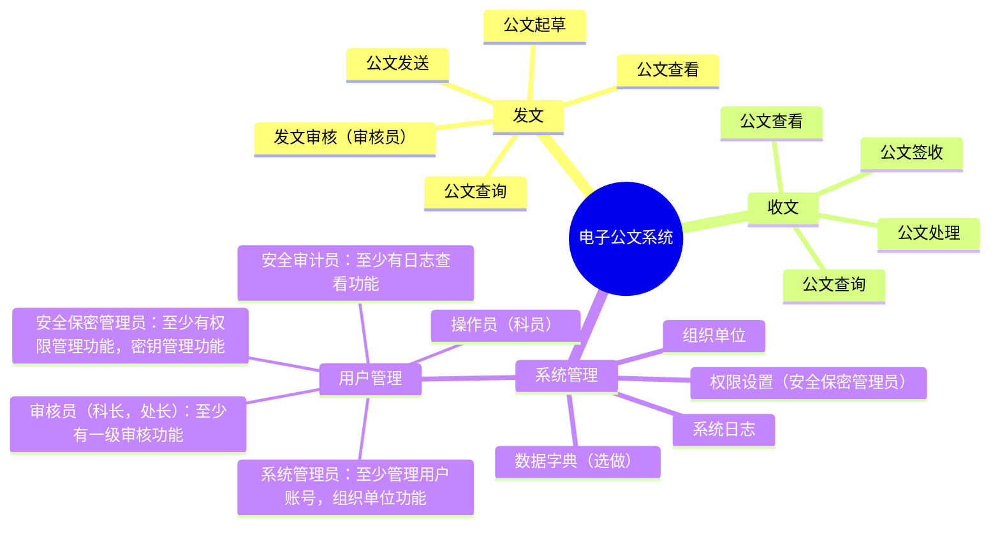
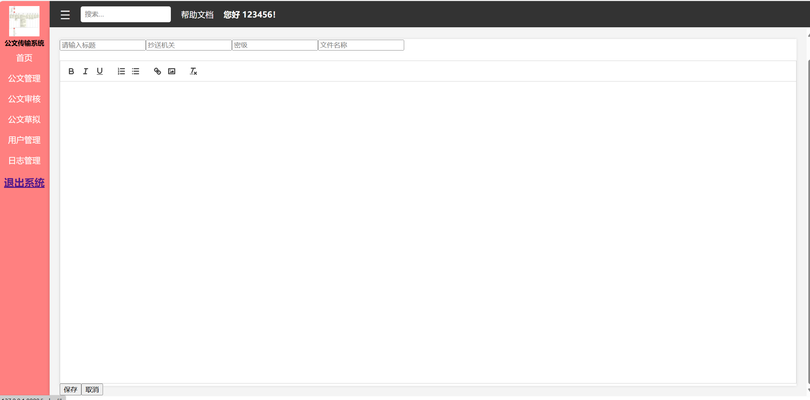

<!--more-->	
[toc]

# 实验四	密码模块的应用

## 一、实践要求（40 分）

1. 完成电子公文交换系统，[系统功能](https://mermaid.live/edit#pako:eNqFks1qwkAUhV8lzErBJ8i62666zWZwxjbgJJJOFkWElvpTKaFKtbagWEsFFzUKxSoE9WUyM_EtOk42MRW7u3POd-fcC7cM8jbCQAfEtBCBJcPSNMe2aSYjOgs2bbHaF39piO9ABMNsdu9qGntqSy2u1Vsx0WIZec20yodj0X9MqKqX-SP-vkqz0tvd3h35IZp9xCrv_BxJFtONNP5NjjM-q6JVP5UR7yr80QEngqoIGszrhmsvoXYm_GGZZtWkz1647rP266EcL_5HTmYe6Wmy2iTcDtisfhKRn0f-6MDkg_vdWyvyN2LtJ8ZWcbw3Zttegu3OueezaY_VViAHCHYINJE8jfKeMQC9wgQbQJclwgXoFqkBDKsiUehS--LGygOdOi7OAbeEIMVnJrx0IAF6ARavpYqRSW3nPD43dXWVX60rGeU)，（15 分）




-  总体要求
   - 项目类型必须是B/S或C/S架构
   - 项目程序设计语言可以是C，Python，Rust等

2. 三员制度是指将系统管理员、安全保密管理员和安全审计员三个角色分离，分别负责系统运行、安全保密和安全管理，相互制约，共同保障信息系统安全。三员职责

- 系统管理员
  - 负责信息系统的日常维护、故障处理和升级更新。
  - 确保系统正常运行，对系统资源进行合理分配。
  - 负责用户账号的创建、修改和删除。
  - 定期备份重要数据，确保数据安全。
- 安全保密管理员
  - 负责制定和实施安全保密策略，确保信息系统安全。    
  - 对用户进行安全意识培训，提高用户安全防范能力。
  - 监控网络安全状况，发现异常情况及时处理。
  - 负责信息系统安全事件的应急响应和处理。
- 安全审计员
  - 负责对信息系统进行安全审计，评估安全风险。
  - 监督系统管理员和安全保密管理员的工作，确保其履行职责。
  - 对信息系统安全事件进行调查，提出整改建议。

3.  黄金法则（5 分 ）
    - 身份鉴别：口令不能存，数据库要保存加盐的SM3Hash值
    - 访问控制：操作员，审核员，安全三员的权限设置
    - 安全审计：至少完成日志查询功能
4.  密码（15 分）
    - 算法：SM2，SM3，SM4，推荐使用 Key
    - 密钥管理：所有私钥，对称算法密钥等不能明存
5.  系统量化评估（5分）
    - 按照[商用密码应用安全性评估量化评估规则](https://ht.cacrnet.org.cn/upload/file/20230718/1689639379401088.pdf),计算自己系统的得分，只计算应用和数据安全。
6.  提交要求：

- 提交实践过程Markdown和转化的PDF文件
- 代码，文档托管到gitee或github等，推荐 gitclone 
- 记录实验过程中遇到的问题，解决过程，反思等内容，用于后面实验报告

## 二、项目实现

### 1.网站首页


### 2.公文管理


能够管理未发送的公文

### 3.公文审核


审核发送给自己的公文

### 5.公文搜索


能够模糊搜索公文

### 6.用户管理


能够管理用户信息、权限

### 7.上传下载




能够上传公文

## 三、实践要求

### 1.项目信息
本项目是b/s架构，使用python进行实现
### 2.三员制度实现

实现了相应功能，具体职责划分通过人员管理实现

### 3.黄金法则

- 身份鉴别：口令不能存，数据库要保存加盐的SM3Hash值
 对口令做了加盐的SM3哈希保护用户的个人隐私


- 访问控制：操作员，审核员，安全三员的权限设置
  设置用户密级，低密级用户无法访问高密级文件，报告管理员记录日志

  
  
- 安全审计：至少完成日志查询功能


### 3.  密码（15 分）
    - 算法：SM2，SM3，SM4，推荐使用 Key
    使用sm2、sm3、sm4算法
```python
from django.shortcuts import render, redirect
from django.shortcuts import HttpResponse
from django.contrib import messages
from .models import UserProfile, Document, Log
from django.http import JsonResponse
from django.conf import settings
from rest_framework.decorators import api_view
from rest_framework.response import Response
from django.contrib.auth.decorators import login_required
from django.http import HttpRequest
from .forms import UserForm, AvatarUploadForm
from django.http import HttpResponseRedirect
from django.urls import reverse
from django.shortcuts import get_object_or_404
from django.views.decorators.csrf import csrf_exempt

from random import SystemRandom
from gmssl import sm2, sm4, func
import binascii
from gmssl.sm4 import CryptSM4, SM4_ENCRYPT, SM4_DECRYPT
from gmssl.sm3 import sm3_hash
import secrets
import base64
from django.utils import timezone
from docx import Document as Docu
import traceback  # 导入 traceback 模块
import time, os, json, random, string
from PIL import Image
from os.path import join

def sm3_hash_with_salt(password, salt):
    # 使用SM3算法生成哈希值
    hash_hex = sm3_hash(func.bytes_to_list(bytes(password, encoding='utf-8')))
    # 使用提供的盐替换提取部分
    new_hash_hex = hash_hex[:4] + salt + hash_hex[19:]
    return new_hash_hex

def generate_random_string(length=15):
    # 生成一个随机字符串
    characters = string.ascii_letters + string.digits + string.punctuation
    random_string = ''.join(random.choice(characters) for i in range(length))
    return random_string

def sm3_hash_data(data):
    return sm3_hash(func.bytes_to_list(bytes(data, encoding='utf-8')))

def sm4_encrypt(key, plaintext):
    key_bytes = bytes(key, encoding='utf-8')
    plaintext_bytes = bytes(plaintext, encoding='utf-8')
    crypt_sm4 = sm4.CryptSM4()
    crypt_sm4.set_key(key_bytes, sm4.SM4_ENCRYPT)
    encrypted_bytes = crypt_sm4.crypt_ecb(plaintext_bytes)
    return base64.b64encode(encrypted_bytes).decode()

def sm4_decrypt(key, ciphertext):
    key_bytes = bytes(key, encoding='utf-8')
    ciphertext_bytes = base64.b64decode(ciphertext)
    crypt_sm4 = sm4.CryptSM4()
    crypt_sm4.set_key(key_bytes, sm4.SM4_DECRYPT)
    decrypted_bytes = crypt_sm4.crypt_ecb(ciphertext_bytes)
    return decrypted_bytes.decode()

# Create your views here.
def login(request):
    if request.method == 'POST':
        id_in = request.POST['id_in']
        password_in = request.POST['password_in']
        print(id_in)
        # 查询数据库，检查用户是否存在
        try:
            user_profile = UserProfile.objects.get(id=id_in)
        except UserProfile.DoesNotExist:
            messages.error(request, '学号或密码错误，请重新输入。')
            return redirect('login')

        # 获取存储的盐值
        salt = user_profile.salt

        # 计算带盐的SM3哈希值
        salted_hash_password_in = sm3_hash_with_salt(password_in, salt)
        print(salted_hash_password_in)

        # 比较哈希值
        if salted_hash_password_in == user_profile.password_up:
            # 登录成功，将用户信息存储到session中
            request.session['user_id'] = user_profile.id
            request.session['username'] = user_profile.username_up

            LogData = Log.objects.create(
                username = user_profile.username_up,
                documentname = "无",
                operation = f'用户{user_profile.username_up}于{timezone.now()}登录了系统。'
            )
            LogData.save()

            # 可以在这里添加其他处理，例如重定向到成功页面或显示成功消息
            # 登录成功，添加消息
            time.sleep(3)
            return redirect('index')
        else:
            messages.error(request, '学号或密码错误，请重新输入。')
            return redirect('login')

    return render(request, 'login.html')  # 替换为你的模板路径

def register(request):
    if request.method == 'POST':
        id = request.POST['id']
        username_up = request.POST['username_up']
        email = request.POST['email']
        password_up = request.POST['password_up']

        # 检查id的唯一性
        if UserProfile.objects.filter(id=id).exists():
            messages.error(request, '学号已存在，请使用不同的学号。')
            return redirect('register')

        # 生成随机盐值
        salt = generate_random_string(15)

        # 计算带盐的SM3哈希值
        salted_hash_password = sm3_hash_with_salt(password_up, salt)
        print(salted_hash_password)

        # 对加盐哈希值进行SM3运算
        sm3_hashed_password = sm3_hash_data(salted_hash_password)

        # 取前16个字符作为SM4密钥
        sm4_key = sm3_hashed_password[:16]

        priKey = PrivateKey()
        pubKey = priKey.publicKey()
        print(priKey.toString())
        # 使用SM4加密私钥
        encrypted_private_key = sm4_encrypt(sm4_key, priKey.toString())
        print(encrypted_private_key)
        new_user = UserProfile.objects.create(
            id=id,
            username_up=username_up,
            email=email,
            password_up=salted_hash_password,  # 存储带盐的SM3哈希值
            salt=salt,  # 存储盐值
            public_key=pubKey.toString(compressed=False),  # 存储公钥
            private_key=encrypted_private_key, # 存储私钥
            avatar='avatars/default_avatar.png'
        )
        new_user.save()

        LogData = Log.objects.create(
            username = new_user.username_up,
            documentname = "无",
            operation = f'用户{new_user.username_up}于{timezone.now()}注册了账号。'
        )
        LogData.save()

        # 添加成功消息
        messages.success(request, '注册成功，请登录。')
        time.sleep(3)
        return redirect('login')

    return render(request, 'register.html')  # 替换为你的模板路径

def index(request):
    # 检查用户是否登录
    if 'user_id' in request.session:
        user_id = request.session['user_id']
        username = request.session['username']
        try:
            # 根据用户名查询用户的访问权限
            user_profile = UserProfile.objects.get(username_up=username)
            access_level = user_profile.access_level

            # 获取用户头像的 URL
            user_avatar_url = user_profile.avatar.url if user_profile.avatar else '/avatars/default_avatar.png'
            print(user_avatar_url)
            # 调整图片大小
            # 假设用户头像在media文件夹下的avatars文件夹内
            if user_avatar_url and 'avatars' in user_avatar_url:
                #image_path = join(settings.BASE_DIR, 'web', user_avatar_url.lstrip('/').replace('/', '\\'))  # 移除url开头的斜杠并替换斜杠为反斜杠
                image_path = join(settings.BASE_DIR, 'web', user_avatar_url.lstrip('/'))
                print(settings.MEDIA_ROOT)
                print(user_avatar_url[1:])
                print(image_path)
                image = Image.open(image_path)
                resized_image = image.resize((60, 60))  # 设置新的宽度和高度
                resized_image.save(image_path)  # 覆盖原始图片文件

            # 构建完整的 URL
            user_avatar_full_url = request.build_absolute_uri(user_avatar_url)
            print(user_avatar_full_url)
            return render(request, 'index.html',
                          {'user_id': user_id, 'username': username, 'access_level': access_level,
                           'user_avatar_url': user_avatar_full_url})
        except UserProfile.DoesNotExist:
            # 处理未找到用户的情况
            # 可以引发 Http404 异常或者进行其他适当的处理
            pass

    else:
        # 用户未登录，可以重定向到登录页面或其他处理
        return redirect('login')

def save_document(request: HttpRequest):
    if request.method == 'POST':
        try:
            # 获取当前登录的用户
            current_user = request.session['user_id']
            current_user_name = request.session['username']

            data = json.loads(request.body)
            title = data.get('title')
            content = data.get('content')
            security_level = data.get('securityLevel')
            cc_office = data.get('cc_office')
            # print(data)
            file_address = data.get('file_address')

            # 获取当前时间
            current_time = timezone.now()
            docname = file_address + '.docx'
            # 创建一个新的文档对象
            doc = Docu()

            # 添加标题
            doc.add_heading(title, level=1)

            # 添加 HTML 内容
            doc.add_paragraph(content)

            # 保存文档
            file_path = os.path.join(settings.BASE_DIR, 'web', 'static', 'docx', docname)
            # 在保存文档前打印文件路径
            # print("File path:", file_path)

            # 检查文档对象是否被正确创建
            # print("Document:", doc)
            doc.save(file_path)

            # 保存文档信息到数据库
            new_document = Document.objects.create(
                document_name=title,
                document_owner = current_user,
                issuing_office=current_user,
                issue_date=current_time,
                security_level=security_level,
                cc_office=cc_office,
                file_type='docx',
                modifier=current_user,
                modified_date=current_time,
                file_address=docname
            )
            new_document.save()
            print("Document saved successfully to the database.")

            key = get_or_generate_key(file_address) ##sm4密钥
            encrypt_and_hash_file(file_path, key, file_address)

            # 删除原始文件
            os.remove(file_path)
            print(f'原文件已删除：{file_path}')

            sender = UserProfile.objects.get(id=current_user)
            sender_password = sender.password_up
            sm3_hashed_password = sm3_hash_data(sender_password)[:16]
            sender_private_key = sm4_decrypt(sm3_hashed_password, sender.private_key)
            print(sender_private_key)
            sender_public_key = sender.public_key

            cc_office_user = UserProfile.objects.get(username_up=cc_office)
            cc_office_user_password = cc_office_user.password_up
            cc_sm3_hash_pw = sm3_hash_data(cc_office_user_password)[:16]
            cc_office_private_key = sm4_decrypt(cc_sm3_hash_pw, cc_office_user.private_key)
            cc_office_public_key = cc_office_user.public_key

            key_path = os.path.join(settings.BASE_DIR, 'web', 'static', 'key', (file_address + 'key.dat'))
            print(key_path)
            key_encrypt_path = os.path.join(settings.BASE_DIR, 'web', 'static', 'key', (file_address + 'encryptkey.dat'))
            encrypt_data(public_key=cc_office_public_key,
                         private_key=cc_office_private_key,
                         input_file=key_path,
                         output_file=key_encrypt_path)
            os.remove(key_path)
            key_sign_path = os.path.join(settings.BASE_DIR, 'web', 'static', 'sign', (file_address + 'signkey.dat'))
            print(key_sign_path)
            sign_data(public_key=sender_public_key,
                      private_key=sender_private_key,
                      input_file=key_encrypt_path,
                      signature_file=key_sign_path)

            LogData = Log.objects.create(
                username=current_user_name,
                documentname=new_document.document_name,
                operation=f'用户{current_user_name}于{timezone.now()}创建了公文：{new_document.document_name}。'
            )
            LogData.save()

            return HttpResponse({'message': 'Document saved successfully'})  # 返回成功消息
        except Exception as e:
            traceback.print_exc()  # 打印异常信息到控制台
            return HttpResponse({'message': 'Internal Server Error'}, status=500)

    return HttpResponse({'message': 'Invalid request'}, status=400)  # 处理无效请求

@csrf_exempt
def delete_document(request, documentname):
    current_user = request.session['username']
    if request.method == 'DELETE':
        # print(f'要删除的公文：{documentname}')
        # 从数据库中查找要删除的文档
        document = get_object_or_404(Document, document_name=documentname)

        file_enc_path = os.path.join(settings.BASE_DIR, 'web', 'static', 'docx', (documentname + '.enc'))
        file_path = os.path.join(settings.BASE_DIR, 'web', 'static', 'docxs', (documentname + '.docx'))
        key_path = os.path.join(settings.BASE_DIR, 'web', 'static', 'key', (documentname + 'key.dat'))
        key_enc_path = os.path.join(settings.BASE_DIR, 'web', 'static', 'key', (documentname + 'encryptkey.dat'))
        keyhash_path = os.path.join(settings.BASE_DIR, 'web', 'static', 'secure', (documentname + 'hash_decrypted.dat'))
        keyorig_path = os.path.join(settings.BASE_DIR, 'web', 'static', 'secure', (documentname + 'hash_original.dat'))
        keysign_path = os.path.join(settings.BASE_DIR, 'web', 'static', 'sign', (documentname + 'signkey.dat'))
        if os.path.exists(file_enc_path):
            os.remove(file_enc_path)
            print(f"File {file_enc_path} deleted successfully")
        else:
            print(f"File {file_enc_path} does not exist")
        if os.path.exists(file_path):
            os.remove(file_path)
            print(f"File {file_path} deleted successfully")
        else:
            print(f"File {file_path} does not exist")
        if os.path.exists(key_path):
            os.remove(key_path)
            print(f"File {key_path} deleted successfully")
        else:
            print(f"File {key_path} does not exist")
        if os.path.exists(key_enc_path):
            os.remove(key_enc_path)
            print(f"File {key_enc_path} deleted successfully")
        else:
            print(f"File {key_enc_path} does not exist")
        if os.path.exists(keyhash_path):
            os.remove(keyhash_path)
            print(f"File {keyhash_path} deleted successfully")
        else:
            print(f"File {keyhash_path} does not exist")
        if os.path.exists(keyorig_path):
            os.remove(keyorig_path)
            print(f"File {keyorig_path} deleted successfully")
        else:
            print(f"File {keyorig_path} does not exist")
        if os.path.exists(keysign_path):
            os.remove(keysign_path)
            print(f"File {keysign_path} deleted successfully")
        else:
            print(f"File {keysign_path} does not exist")

        LogData = Log.objects.create(
            username=current_user,
            documentname=document.document_name,
            operation=f'用户{current_user}于{timezone.now()}删除了公文：{document.document_name}。'
        )
        LogData.save()

        # 删除文档
        document.delete()

        # 返回成功的 JSON 响应
        return JsonResponse({'message': 'Document deleted successfully'})

    # 如果请求方法不是 DELETE，则返回错误响应
    return JsonResponse({'error': 'Invalid request method'}, status=400)

def get_users(request):
    # 从数据库中获取用户信息
    users = UserProfile.objects.all().values()  # 假设 User 有合适的字段来表示用户信息

    # 将查询到的数据转换为列表，并以 JSON 格式返回给前端
    return JsonResponse(list(users), safe=False)

from .forms import UserForm

def create_user(request):
    current_user = request.session['username']
    if request.method == 'POST':
        form = UserForm(request.POST)
        if form.is_valid():
            # 获取表单数据并保存到数据库
            id = form.cleaned_data['id']
            username = form.cleaned_data['username_up']
            email = form.cleaned_data['email']
            password = form.cleaned_data['password_up']

            # 生成随机盐值
            salt = generate_random_string(15)
            # 计算带盐的SM3哈希值
            salted_hash_password = sm3_hash_with_salt(password, salt)
            print(salted_hash_password)

            # 对加盐哈希值进行SM3运算
            sm3_hashed_password = sm3_hash_data(salted_hash_password)

            # 取前16个字符作为SM4密钥
            sm4_key = sm3_hashed_password[:16]

            priKey = PrivateKey()
            pubKey = priKey.publicKey()

            # 使用SM4加密私钥
            encrypted_private_key = sm4_encrypt(sm4_key, priKey.toString())

            # 保存到数据库中
            UserProfile.objects.create(
                id=id,
                username_up=username,
                email=email,
                password_up=salted_hash_password,  # 存储带盐的SM3哈希值
                salt=salt,  # 存储盐值
                public_key=pubKey.toString(compressed=False),  # 存储公钥
                private_key=encrypted_private_key,  # 存储私钥
                avatar='avatars/default_avatar.png'
            )

            LogData = Log.objects.create(
                username=current_user,
                documentname="无",
                operation=f'用户{current_user}于{timezone.now()}创建了新用户{username}。'
            )
            LogData.save()

            # 重定向到 index 页面，使用 HttpResponseRedirect 对象
            return HttpResponseRedirect(reverse('index'))

    else:
        form = UserForm()

    return render(request, 'adduser.html', {'form': form})

def delete_user(request, user_id):
    current_user = request.session['username']
    if request.method == 'DELETE':
        user = get_object_or_404(UserProfile, id=user_id)

        LogData = Log.objects.create(
            username=current_user,
            documentname="无",
            operation=f'用户{current_user}于{timezone.now()}删除了用户{user.username_up}。'
        )
        LogData.save()

        user.delete()
        return JsonResponse({'message': 'User deleted successfully'}, status=200)
    else:
        return JsonResponse({'message': 'Invalid request method'}, status=400)

def change_userinfo(request, user_id):
    current_user = request.session['username']
    try:
        user_profile = UserProfile.objects.get(id=user_id)

        # 如果是 POST 请求，即提交表单
        if request.method == 'POST':
            # 获取表单中的数据
            username = request.POST.get('username_up')
            email = request.POST.get('email')
            password = request.POST.get('password_up')

            # 如果密码不为空，则更新密码
            if password:
                # 生成新的随机盐值
                salt = generate_random_string(15)
                # 计算带盐的SM3哈希值
                salted_hash_password = sm3_hash_with_salt(password, salt)
                sm3_hash_key = sm3_hash_data(salted_hash_password)
                sm4_key = sm3_hash_key[:16]
                old_salted_hash_pw = sm3_hash_data(user_profile.password_up)
                old_sm4_key = old_salted_hash_pw[:16]

                old_prikey = sm4_decrypt(old_sm4_key, user_profile.private_key)
                new_encrypted_prikey = sm4_encrypt(sm4_key, old_prikey)
                # 更新用户密码和盐值
                user_profile.password_up = salted_hash_password
                user_profile.salt = salt
                user_profile.private_key = new_encrypted_prikey

            # 更新用户信息
            user_profile.username_up = username
            user_profile.email = email

            LogData = Log.objects.create(
                username=current_user,
                documentname="无",
                operation=f'用户{current_user}于{timezone.now()}修改了{username}的用户信息。'
            )
            LogData.save()

            # 保存更新后的信息到数据库
            user_profile.save()

            return redirect('index')  # 更新成功后重定向到首页
        else:
            # 如果是 GET 请求，即用户访问修改页面
            return render(request, 'change_userinfo.html', {'user_profile': user_profile})

    except UserProfile.DoesNotExist:
        messages.error(request, '用户不存在。')
        return redirect('index')    # 处理用户不存在的情况

# def change_userinfo(request, user_id):
#     current_user = request.session['username']
#     try:
#         user_profile = UserProfile.objects.get(id=user_id)
#
#         # 如果是 POST 请求，即提交表单
#         if request.method == 'POST':
#             # 获取表单中的数据
#             username = request.POST.get('username_up')
#             email = request.POST.get('email')
#             password = request.POST.get('password_up')
#
#             # 如果密码不为空，则更新密码
#             if password:
#                 # 生成新的随机盐值
#                 salt = generate_random_string(15)
#                 # 计算带盐的SM3哈希值
#                 salted_hash_password = sm3_hash_with_salt(password, salt)
#
#                 # 更新用户密码和盐值
#                 user_profile.password_up = salted_hash_password
#                 user_profile.salt = salt
#
#             # 更新用户信息
#             user_profile.username_up = username
#             user_profile.email = email
#
#             LogData = Log.objects.create(
#                 username=current_user,
#                 documentname="无",
#                 operation=f'用户{current_user}于{timezone.now()}修改了{username}的用户信息。'
#             )
#             LogData.save()
#
#             # 保存更新后的信息到数据库
#             user_profile.save()
#
#             return redirect('index')  # 更新成功后重定向到首页
#         else:
#             # 如果是 GET 请求，即用户访问修改页面
#             return render(request, 'change_userinfo.html', {'user_profile': user_profile})
#
#     except UserProfile.DoesNotExist:
#         messages.error(request, '用户不存在。')
#         return redirect('index')    # 处理用户不存在的情况

def manage_permission(request, user_id):
    current_user = request.session['username']
    # 根据 user_id 获取特定用户的信息或权限
    user = UserProfile.objects.get(id=user_id)

    if request.method == 'POST':
        access_level = request.POST['access_level']
        user.access_level = access_level

        LogData = Log.objects.create(
            username=current_user,
            documentname="无",
            operation=f'用户{current_user}于{timezone.now()}修改了{user.username_up}的访问权限。'
        )
        LogData.save()

        user.save()  # 将更改后的访问权限保存到数据库

        # 重定向到 index 页面
        return redirect('index')

    # 渲染 manage_permission.html 页面，并传递用户信息或权限
    return render(request, 'manage_permission.html', {'user': user})

@csrf_exempt
def get_documents_in_docmanager(request):
    current_user = request.session['user_id']
    # 从数据库中获取所有公文
    if request.method == 'POST':
        try:
            data = json.loads(request.body)
            keyword = data.get('keyword', '')
        except json.JSONDecodeError:
            return JsonResponse({'error': '请求体格式错误'}, status=400)

            # 根据关键词过滤公文
        documents = Document.objects.filter(
            document_owner=current_user,
            is_sent=0,
            document_name__icontains=keyword  # 假设我们根据公文名称过滤
        )
        # 将公文数据转换为 JSON 格式
        data = [
            {
                'current_user': current_user,
                'id': doc.document_id,
                'title': doc.document_name,
                'securityLevel': doc.security_level,
                'owner': doc.document_owner,
                'office': doc.issuing_office,
                'sendTime': doc.issue_date.strftime('%Y-%m-%d'),  # 将日期格式化为字符串
                'is_sent': doc.is_sent,
                'cc_office': doc.cc_office,
                'file_address': doc.file_address,
                'is_pass': doc.is_pass,
                # 可以添加其他字段
            }
            for doc in documents
        ]
    # 发送 JSON 格式的数据给前端
        return JsonResponse(data, safe=False)

@csrf_exempt
def get_documents_in_docjudge(request):
    current_user = request.session['username']
    # 从数据库中获取所有公文
    if request.method == 'POST':
        try:
            data = json.loads(request.body)
            keyword = data.get('keyword', '')
        except json.JSONDecodeError:
            return JsonResponse({'error': '请求体格式错误'}, status=400)

            # 根据关键词过滤公文
        documents = Document.objects.filter(
            cc_office=current_user,
            is_sent=1,
            document_name__icontains=keyword  # 假设我们根据公文名称过滤
        )
        # 将公文数据转换为 JSON 格式
        data = [
            {
                'current_user': current_user,
                'id': doc.document_id,
                'title': doc.document_name,
                'securityLevel': doc.security_level,
                'owner': doc.document_owner,
                'office': doc.issuing_office,
                'sendTime': doc.issue_date.strftime('%Y-%m-%d'),  # 将日期格式化为字符串
                'is_sent': doc.is_sent,
                'cc_office': doc.cc_office,
                'file_address': doc.file_address,
                'is_pass': doc.is_pass,
                # 可以添加其他字段
            }
            for doc in documents
        ]
    # 发送 JSON 格式的数据给前端
        return JsonResponse(data, safe=False)

@csrf_exempt
def update_document_status(request):
    current_user = request.session['username']
    if request.method == 'POST':
        data = json.loads(request.body)
        document_name = data.get('documentName')
        cc_office = data.get('ccOffice')

        # 添加日志打印
        # print("Received document_name:", document_name)
        # print("Received cc_office:", cc_office)
        try:
            # 根据 document_id 获取对应的文档
            document = Document.objects.get(document_name=document_name)
            document.is_sent = 1
            document.document_owner = cc_office

            LogData = Log.objects.create(
                username=current_user,
                documentname=document.document_name,
                operation=f'用户{current_user}于{timezone.now()}发送了公文：{document.document_name}。'
            )
            LogData.save()

            document.save()

            return JsonResponse({'message': 'Document status updated successfully'})
        except Document.DoesNotExist:
            # print(f"Document with ID {document_name} does not exist.")
            return JsonResponse({'message': 'Document does not exist'}, status=404)
        except Exception as e:
            # print("Error:", e)
            return JsonResponse({'message': 'Internal Server Error'}, status=500)

    return JsonResponse({'message': 'Invalid request'}, status=400)

@csrf_exempt
def approveDocument(request):
    current_user = request.session['username']
    if request.method == 'POST':
        data = json.loads(request.body)
        document_name = data.get('documentName')

        # 添加日志打印
        # print("Received document_name:", document_name)
        try:
            # 根据 document_id 获取对应的文档
            document = Document.objects.get(document_name=document_name)
            document.is_pass = 1
            document.is_sent = 1

            LogData = Log.objects.create(
                username=current_user,
                documentname=document.document_name,
                operation=f'用户{current_user}于{timezone.now()}通过了公文：{document.document_name}。'
            )
            LogData.save()

            document.save()

            return JsonResponse({'message': 'Document status updated successfully'})
        except Document.DoesNotExist:
            # print(f"Document with ID {document_name} does not exist.")
            return JsonResponse({'message': 'Document does not exist'}, status=404)
        except Exception as e:
            # print("Error:", e)
            return JsonResponse({'message': 'Internal Server Error'}, status=500)

    return JsonResponse({'message': 'Invalid request'}, status=400)

@csrf_exempt
def rejectDocument(request):
    current_user = request.session['username']
    if request.method == 'POST':
        data = json.loads(request.body)
        document_name = data.get('documentName')
        doc_issuing_office = data.get('issuing_office')

        # 添加日志打印
        # print("Received document_name:", document_name)
        # print("Received doc_issuing_office:", doc_issuing_office)
        try:
            # 根据 document_id 获取对应的文档
            document = Document.objects.get(document_name=document_name)
            document.is_pass = 0
            document.is_sent = 0
            document.document_owner = document.issuing_office

            LogData = Log.objects.create(
                username=current_user,
                documentname=document.document_name,
                operation=f'用户{current_user}于{timezone.now()}拒绝了公文：{document.document_name}。'
            )
            LogData.save()

            document.save()

            return JsonResponse({'message': 'Document status updated successfully'})
        except Document.DoesNotExist:
            # print(f"Document with ID {document_name} does not exist.")
            return JsonResponse({'message': 'Document does not exist'}, status=404)
        except Exception as e:
            # print("Error:", e)
            return JsonResponse({'message': 'Internal Server Error'}, status=500)

    return JsonResponse({'message': 'Invalid request'}, status=400)

def decrypt_document(request):
    current_user = request.session['username']
    if request.method == 'POST':
        # 获取传递的文件地址或其他必要信息
        data = json.loads(request.body)
        file_title = data.get('file_title')
        file_name = data.get('file_name')

        # print(file_title)
        # print(file_name)
        # print(file_title + ".docx")
        doc = Document.objects.get(file_address=file_title + ".docx")
        file_path = os.path.join(settings.BASE_DIR, 'web', 'static', 'docx', file_name)
        print(file_path)
        doc_owner = doc.issuing_office
        cc_office = doc.cc_office

        sender_keyowner = UserProfile.objects.get(id=doc_owner)
        sender_password = sender_keyowner.password_up
        sender_publickey = sender_keyowner.public_key

        sender_sm3_hashed_password = sm3_hash_data(sender_password)[:16]
        sender_privatekey = sm4_decrypt(sender_sm3_hashed_password, sender_keyowner.private_key)

        key_owner = UserProfile.objects.get(username_up=cc_office)
        key_owner_password = key_owner.password_up

        key_owner_sm3_hashed_password = sm3_hash_data(key_owner_password)[:16]
        publickey = key_owner.public_key
        privatekey = sm4_decrypt(key_owner_sm3_hashed_password, key_owner.private_key)

        print(privatekey)
        key_sign_path = os.path.join(settings.BASE_DIR, 'web', 'static', 'sign', (file_title + 'signkey.dat'))
        key_encrypt_path = os.path.join(settings.BASE_DIR, 'web', 'static', 'key', (file_title + 'encryptkey.dat'))
        verify_signature(public_key=sender_publickey,
                         private_key=sender_privatekey,
                         input_file=key_encrypt_path,
                         signature_file=key_sign_path)

        key_path = os.path.join(settings.BASE_DIR, 'web', 'static', 'key', (file_title + 'key.dat'))

        decrypt_data(public_key=publickey,
                     private_key=privatekey,
                     input_file=key_encrypt_path,
                     output_file=key_path)

        key = get_or_generate_key(file_title)
        # print(f'对称密钥的类型为：{type(key)}')
        # 在这里执行文件解密的操作
        decrypted_file_address = decrypt_and_hash_file(file_path, key, file_title)

        LogData = Log.objects.create(
            username=current_user,
            documentname=doc.document_name,
            operation=f'用户{current_user}于{timezone.now()}下载了公文：{doc.document_name}。'
        )
        LogData.save()

        # 返回解密结果（成功或失败）
        return JsonResponse({'message': '文件解密成功', 'decrypted_file_address': decrypted_file_address})  # 或者其他成功信息
    else:
        return JsonResponse({'message': '无效的请求'}, status=400)


## 密码功能实现
## SM4对称密码算法、SM3哈希摘要算法 ##
def get_or_generate_key(document_name):
    # 尝试从外部输入获取密钥
    key_file_path = os.path.join(settings.BASE_DIR, 'web', 'static', 'key', (document_name + 'key.dat'))
    print(key_file_path)
    if os.path.exists(key_file_path):
        with open(key_file_path, 'rb') as key_file:
            key = key_file.read()
            print(key)
            print(len(key))
            if len(key) != 16:
                # print("密钥长度必须为16字节")
                return None
    else:
        # 生成随机的16字节密钥
        key = secrets.token_bytes(16)
        with open(key_file_path, 'wb') as key_file:
            key_file.write(key)

    return key

def encrypt_and_hash_file(input_file_path, key, document_name):
    # 读取文件内容
    with open(input_file_path, 'rb') as file:
        plaintext = file.read()

    # 计算文件的哈希值
    hash_value = sm3_hash(list(plaintext))  # Convert bytes to list
    hash_file_path = os.path.join(settings.BASE_DIR, 'web', 'static', 'secure', (document_name + 'hash_original.dat'))
    with open(hash_file_path, 'w') as hash_file:
        hash_file.write(hash_value)

    # print(f'原文件的哈希值已保存到：{hash_file_path}')

    # 初始化SM4加密器
    crypt_sm4 = CryptSM4()

    # 设置密钥
    crypt_sm4.set_key(key, SM4_ENCRYPT)

    # 加密文件内容
    ciphertext = crypt_sm4.crypt_ecb(plaintext)

    # 创建加密后的文件
    encrypted_file_path = os.path.join(settings.BASE_DIR, 'web', 'static', 'docx', (document_name + '.enc'))
    with open(encrypted_file_path, 'wb') as file:
        file.write(ciphertext)

    # print(f'文件加密成功：{encrypted_file_path}')


def decrypt_and_hash_file(encrypted_file_path, key, document_name):
    # 初始化SM4解密器
    crypt_sm4 = CryptSM4()

    # 设置密钥
    crypt_sm4.set_key(key, SM4_DECRYPT)

    # 读取加密文件内容
    with open(encrypted_file_path, 'rb') as file:
        ciphertext = file.read()

    # 解密文件内容
    plaintext = crypt_sm4.crypt_ecb(ciphertext)

    # 创建解密后的文件
    decrypted_file_path = os.path.join(settings.BASE_DIR, 'web', 'static', 'docxs', (document_name + '.docx'))
    with open(decrypted_file_path, 'wb') as file:
        file.write(plaintext)

    # print(f'文件解密成功：{decrypted_file_path}')

    # 计算解密文件的哈希值
    hash_value = sm3_hash(list(plaintext))  # Convert bytes to list

    # 将哈希值保存到hash_decrypted.txt文件
    hash_decrypted_file_path = os.path.join(settings.BASE_DIR, 'web', 'static', 'secure', (document_name + 'hash_decrypted.dat'))
    with open(hash_decrypted_file_path, 'w') as hash_file:
        hash_file.write(hash_value)

    # print(f'解密文件的哈希值已保存到：{hash_decrypted_file_path}')

    # 比较原始哈希和解密后的哈希
    hash_original_file = os.path.join(settings.BASE_DIR, 'web', 'static', 'secure',
                                      (document_name + 'hash_original.dat'))
    hash_decrypted_file = os.path.join(settings.BASE_DIR, 'web', 'static', 'secure',
                                       (document_name + 'hash_decrypted.dat'))

    with open(hash_original_file, 'rb') as original, open(hash_decrypted_file, 'rb') as decrypted:
        original_hash = original.read()
        decrypted_hash = decrypted.read()

        if original_hash == decrypted_hash:
            print("加密和解密后的文件内容一致。")
        else:
            print("加密和解密后的文件内容不一致。")

    decrypted_file_path_str = f'/static/docxs/{document_name}'+'.docx'

    return decrypted_file_path_str

## SM2算法实现 ##
## SM2密钥生成 ##
class CurveFp:
    def __init__(self, A, B, P, N, Gx, Gy, name):
        self.A = A
        self.B = B
        self.P = P
        self.N = N
        self.Gx = Gx
        self.Gy = Gy
        self.name = name


sm2p256v1 = CurveFp(
    name="sm2p256v1",
    A=0xFFFFFFFEFFFFFFFFFFFFFFFFFFFFFFFFFFFFFFFF00000000FFFFFFFFFFFFFFFC,
    B=0x28E9FA9E9D9F5E344D5A9E4BCF6509A7F39789F515AB8F92DDBCBD414D940E93,
    P=0xFFFFFFFEFFFFFFFFFFFFFFFFFFFFFFFFFFFFFFFF00000000FFFFFFFFFFFFFFFF,
    N=0xFFFFFFFEFFFFFFFFFFFFFFFFFFFFFFFF7203DF6B21C6052B53BBF40939D54123,
    Gx=0x32C4AE2C1F1981195F9904466A39C9948FE30BBFF2660BE1715A4589334C74C7,
    Gy=0xBC3736A2F4F6779C59BDCEE36B692153D0A9877CC62A474002DF32E52139F0A0
)


def multiply(a, n, N, A, P):
    return fromJacobian(jacobianMultiply(toJacobian(a), n, N, A, P), P)


def add(a, b, A, P):
    return fromJacobian(jacobianAdd(toJacobian(a), toJacobian(b), A, P), P)


def inv(a, n):
    if a == 0:
        return 0
    lm, hm = 1, 0
    low, high = a % n, n
    while low > 1:
        r = high // low
        nm, new = hm - lm * r, high - low * r
        lm, low, hm, high = nm, new, lm, low
    return lm % n


def toJacobian(Xp_Yp):
    Xp, Yp = Xp_Yp
    return (Xp, Yp, 1)


def fromJacobian(Xp_Yp_Zp, P):
    Xp, Yp, Zp = Xp_Yp_Zp
    z = inv(Zp, P)
    return ((Xp * z ** 2) % P, (Yp * z ** 3) % P)


def jacobianDouble(Xp_Yp_Zp, A, P):
    Xp, Yp, Zp = Xp_Yp_Zp
    if not Yp:
        return (0, 0, 0)
    ysq = (Yp ** 2) % P
    S = (4 * Xp * ysq) % P
    M = (3 * Xp ** 2 + A * Zp ** 4) % P
    nx = (M ** 2 - 2 * S) % P
    ny = (M * (S - nx) - 8 * ysq ** 2) % P
    nz = (2 * Yp * Zp) % P
    return (nx, ny, nz)


def jacobianAdd(Xp_Yp_Zp, Xq_Yq_Zq, A, P):
    Xp, Yp, Zp = Xp_Yp_Zp
    Xq, Yq, Zq = Xq_Yq_Zq
    if not Yp:
        return (Xq, Yq, Zq)
    if not Yq:
        return (Xp, Yp, Zp)
    U1 = (Xp * Zq ** 2) % P
    U2 = (Xq * Zp ** 2) % P
    S1 = (Yp * Zq ** 3) % P
    S2 = (Yq * Zp ** 3) % P
    if U1 == U2:
        if S1 != S2:
            return (0, 0, 1)
        return jacobianDouble((Xp, Yp, Zp), A, P)
    H = U2 - U1
    R = S2 - S1
    H2 = (H * H) % P
    H3 = (H * H2) % P
    U1H2 = (U1 * H2) % P
    nx = (R ** 2 - H3 - 2 * U1H2) % P
    ny = (R * (U1H2 - nx) - S1 * H3) % P
    nz = (H * Zp * Zq) % P
    return (nx, ny, nz)


def jacobianMultiply(Xp_Yp_Zp, n, N, A, P):
    Xp, Yp, Zp = Xp_Yp_Zp
    if Yp == 0 or n == 0:
        return (0, 0, 1)
    if n == 1:
        return (Xp, Yp, Zp)
    if n < 0 or n >= N:
        return jacobianMultiply((Xp, Yp, Zp), n % N, N, A, P)
    if (n % 2) == 0:
        return jacobianDouble(jacobianMultiply((Xp, Yp, Zp), n // 2, N, A, P), A, P)
    if (n % 2) == 1:
        return jacobianAdd(jacobianDouble(jacobianMultiply((Xp, Yp, Zp), n // 2, N, A, P), A, P), (Xp, Yp, Zp), A, P)


class PrivateKey:
    def __init__(self, curve=sm2p256v1, secret=None):
        self.curve = curve
        self.secret = secret or SystemRandom().randrange(1, curve.N)

    def publicKey(self):
        curve = self.curve
        xPublicKey, yPublicKey = multiply((curve.Gx, curve.Gy), self.secret, A=curve.A, P=curve.P, N=curve.N)
        return PublicKey(xPublicKey, yPublicKey, curve)

    def toString(self):
        return "{}".format(str(hex(self.secret))[2:].zfill(64))


class PublicKey:
    def __init__(self, x, y, curve):
        self.x = x
        self.y = y
        self.curve = curve

    def toString(self, compressed=True):
        return {
            True: str(hex(self.x))[2:],
            False: "{}{}".format(str(hex(self.x))[2:].zfill(64), str(hex(self.y))[2:].zfill(64))
        }.get(compressed)

## SM2加解密和签名验签 ##
def encrypt_data(public_key, private_key, input_file, output_file):
    sm2_crypt = sm2.CryptSM2(public_key=public_key, private_key=private_key)

    with open(input_file, 'rb') as f:
        data = f.read()
    print(public_key)
    print(private_key)
    print(type(public_key))
    print(type(private_key))
    encrypted_data = sm2_crypt.encrypt(data)

    with open(output_file, 'wb') as f:
        f.write(encrypted_data)


def decrypt_data(public_key, private_key, input_file, output_file):
    sm2_crypt = sm2.CryptSM2(public_key=public_key, private_key=private_key)

    with open(input_file, 'rb') as f:
        encrypted_data = f.read()

    decrypted_data = sm2_crypt.decrypt(encrypted_data)

    with open(output_file, 'wb') as f:
        f.write(decrypted_data)


def sign_data(public_key, private_key, input_file, signature_file):
    sm2_crypt = sm2.CryptSM2(public_key=public_key, private_key=private_key)

    with open(input_file, 'rb') as f:
        data = f.read()

    random_hex_str = func.random_hex(sm2_crypt.para_len)
    signature = sm2_crypt.sign(data, random_hex_str)

    with open(signature_file, 'wb') as f:
        f.write(binascii.unhexlify(signature))


def verify_signature(public_key, private_key, input_file, signature_file):
    sm2_crypt = sm2.CryptSM2(public_key=public_key, private_key=private_key)

    with open(input_file, 'rb') as f:
        data = f.read()

    with open(signature_file, 'rb') as f:
        signature = f.read()

    if sm2_crypt.verify(binascii.hexlify(signature).decode(), data):
        print("Signature verification successful")
    else:
        print("Signature verification failed")


def get_user_logs(request):
    current_user = request.session.get('username')
    user = UserProfile.objects.get(username_up=current_user)
    print(user.username_up)

    if user.access_level == 1:  # 管理员权限
        user_logs = Log.objects.filter(documentname="无")  # 获取所有用户日志
        user_logs_data = list(user_logs.values())  # 转换为字典列表
        print(user_logs_data)
        return JsonResponse(user_logs_data, safe=False)

    if user.access_level != 1:
        user_logs = Log.objects.filter(username=user.username_up, documentname="无")
        user_logs_data = list(user_logs.values())  # 转换为字典列表
        print(user_logs_data)
        return JsonResponse(user_logs_data, safe=False)

def get_document_logs(request):
    current_user = request.session.get('username')
    user = UserProfile.objects.get(username_up=current_user)

    if user.access_level == 1:  # 管理员权限
        document_logs = Log.objects.exclude(documentname="无")  # 获取所有公文操作日志
        document_logs_data = list(document_logs.values())  # 转换为字典列表
        print(document_logs_data)
        return JsonResponse(document_logs_data, safe=False)
    if user.access_level != 1:
        document_logs = Log.objects.exclude(documentname="无").filter(username=user.username_up)
        document_logs_data = list(document_logs.values())  # 转换为字典列表
        print(document_logs_data)
        return JsonResponse(document_logs_data, safe=False)

def logout(request):
    current_user = request.session['username']
    # 清除会话信息
    if 'user_id' in request.session:

        LogData = Log.objects.create(
            username=current_user,
            documentname="无",
            operation=f'用户{current_user}于{timezone.now()}退出了系统。'
        )

        LogData.save()

        del request.session['user_id']
        del request.session['username']

    # 重定向到主页或登录页
    return redirect('index')  # 'index' 应该是你的主页 URL 名称或路径

def upload_avatar_page(request):
    # 传递表单给模板，以便在页面上显示上传表单
    form = AvatarUploadForm()
    return render(request, 'upload_avatar.html', {'form': form})

def upload_avatar(request):
    current_user = request.session.get('username')  # 使用 get 方法以避免键不存在时引发 KeyError
    if request.method == 'POST':
        form = AvatarUploadForm(request.POST, request.FILES)
        if form.is_valid():
            try:
                user_profile = UserProfile.objects.get(username_up=current_user)
                avatar_image = form.cleaned_data['avatarFile']
                image = Image.open(avatar_image)
                # 将图像转换为PNG格式并覆盖原始图像文件
                image = image.convert("RGB")
                image.save(user_profile.avatar.path, 'JPEG')
                user_profile.save()
                return redirect('index')  # 重定向到首页或其他页面
            except UserProfile.DoesNotExist:
                # 处理用户不存在的情况
                pass
    else:
        form = AvatarUploadForm()

    return render(request, 'upload_avatar.html', {'form': form})


```
### 4.  系统量化评估（5分）
- 按照[商用密码应用安全性评估量化评估规则](https://ht.cacrnet.org.cn/upload/file/20230718/1689639379401088.pdf),计算自己系统的得分，只计算应用和数据安全。


1.使用身份鉴别，对不同密级人员进行分类0.4

2.访问控制信息未作完整性保护

3.重要信息资源安全标记完整性，对上传的公文使用SM3进行hash运算0.4

4.重要数据传输机密性，使用https进行网站搭建0.4

5.重要数据存储机密性，使用sm4进行加密0.4

6.重要数据传输完整性，使用https保障完整性0.4

7.重要数据存储完整性，使用sm2保障0.4

8.不可否认性，使用SM2进行签名1
